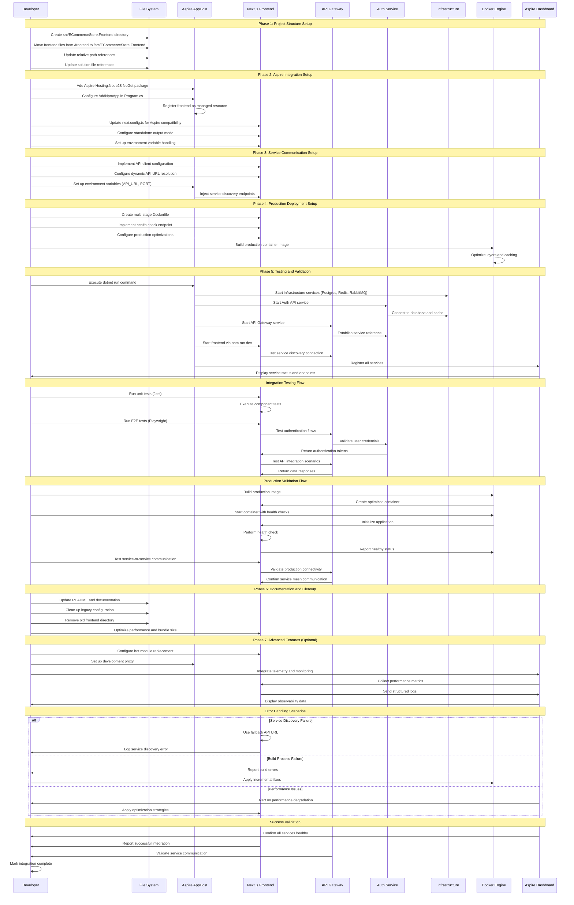

# Frontend Integration Sequence Diagram

```mermaid
sequenceDiagram
    participant Dev as Developer
    participant FS as File System
    participant AppHost as Aspire AppHost
    participant Frontend as Next.js Frontend
    participant API as API Gateway
    participant Auth as Auth Service
    participant Infra as Infrastructure
    participant Docker as Docker Engine
    participant Dashboard as Aspire Dashboard

    Note over Dev, Dashboard: Phase 1: Project Structure Setup
    Dev->>FS: Create src/ECommerceStore.Frontend directory
    Dev->>FS: Move frontend files from /frontend to /src/ECommerceStore.Frontend
    Dev->>FS: Update relative path references
    Dev->>FS: Update solution file references

    Note over Dev, Dashboard: Phase 2: Aspire Integration Setup
    Dev->>AppHost: Add Aspire.Hosting.NodeJS NuGet package
    Dev->>AppHost: Configure AddNpmApp in Program.cs
    AppHost->>AppHost: Register frontend as managed resource
    Dev->>Frontend: Update next.config.ts for Aspire compatibility
    Dev->>Frontend: Configure standalone output mode
    Dev->>Frontend: Set up environment variable handling

    Note over Dev, Dashboard: Phase 3: Service Communication Setup
    Dev->>Frontend: Implement API client configuration
    Dev->>Frontend: Configure dynamic API URL resolution
    Dev->>AppHost: Set up environment variables (API_URL, PORT)
    AppHost->>Frontend: Inject service discovery endpoints

    Note over Dev, Dashboard: Phase 4: Production Deployment Setup
    Dev->>Frontend: Create multi-stage Dockerfile
    Dev->>Frontend: Implement health check endpoint
    Dev->>Frontend: Configure production optimizations
    Dev->>Docker: Build production container image
    Docker->>Docker: Optimize layers and caching

    Note over Dev, Dashboard: Phase 5: Testing and Validation
    Dev->>AppHost: Execute dotnet run command
    AppHost->>Infra: Start infrastructure services (Postgres, Redis, RabbitMQ)
    AppHost->>Auth: Start Auth API service
    Auth->>Infra: Connect to database and cache
    AppHost->>API: Start API Gateway service
    API->>Auth: Establish service reference
    AppHost->>Frontend: Start frontend via npm run dev
    Frontend->>API: Test service discovery connection
    AppHost->>Dashboard: Register all services
    Dashboard->>Dev: Display service status and endpoints

    Note over Dev, Dashboard: Integration Testing Flow
    Dev->>Frontend: Run unit tests (Jest)
    Frontend->>Frontend: Execute component tests
    Dev->>Frontend: Run E2E tests (Playwright)
    Frontend->>API: Test authentication flows
    API->>Auth: Validate user credentials
    Auth->>Frontend: Return authentication tokens
    Frontend->>API: Test API integration scenarios
    API->>Frontend: Return data responses

    Note over Dev, Dashboard: Production Validation Flow
    Dev->>Docker: Build production image
    Docker->>Frontend: Create optimized container
    Dev->>Docker: Start container with health checks
    Docker->>Frontend: Initialize application
    Frontend->>Frontend: Perform health check
    Frontend->>Docker: Report healthy status
    Dev->>Frontend: Test service-to-service communication
    Frontend->>API: Validate production connectivity
    API->>Frontend: Confirm service mesh communication

    Note over Dev, Dashboard: Phase 6: Documentation and Cleanup
    Dev->>FS: Update README and documentation
    Dev->>FS: Clean up legacy configuration
    Dev->>FS: Remove old frontend directory
    Dev->>Frontend: Optimize performance and bundle size

    Note over Dev, Dashboard: Phase 7: Advanced Features (Optional)
    Dev->>Frontend: Configure hot module replacement
    Dev->>AppHost: Set up development proxy
    Dev->>Dashboard: Integrate telemetry and monitoring
    Dashboard->>Frontend: Collect performance metrics
    Frontend->>Dashboard: Send structured logs
    Dashboard->>Dev: Display observability data

    Note over Dev, Dashboard: Error Handling Scenarios
    alt Service Discovery Failure
        Frontend->>Frontend: Use fallback API URL
        Frontend->>Dev: Log service discovery error
    else Build Process Failure
        Docker->>Dev: Report build errors
        Dev->>Docker: Apply incremental fixes
    else Performance Issues
        Dashboard->>Dev: Alert on performance degradation
        Dev->>Frontend: Apply optimization strategies
    end

    Note over Dev, Dashboard: Success Validation
    Dashboard->>Dev: Confirm all services healthy
    Frontend->>Dev: Report successful integration
    API->>Dev: Validate service communication
    Dev->>Dev: Mark integration complete
```