# E-Commerce Store - Comprehensive Flowchart Diagram

## Overview
This flowchart diagram represents the overall process and logic of the e-commerce store platform, showing decision points, data flows, and processing stages across all major workflows.

## Mermaid Flowchart Diagram

```mermaid
flowchart TD
    Start([User Visits Platform]) --> Auth{User Authenticated?}
    
    %% Authentication Flow
    Auth -->|No| LoginChoice{Login or Register?}
    LoginChoice -->|Register| RegForm[Registration Form]
    LoginChoice -->|Login| LoginForm[Login Form]
    
    RegForm --> ValidateReg{Valid Registration?}
    ValidateReg -->|No| RegError[Show Registration Errors]
    RegError --> RegForm
    ValidateReg -->|Yes| CreateUser[Create User Account]
    CreateUser --> SendVerification[Send Email Verification]
    SendVerification --> LoginForm
    
    LoginForm --> ValidateLogin{Valid Credentials?}
    ValidateLogin -->|No| LoginError[Show Login Error]
    LoginError --> LoginForm
    ValidateLogin -->|Yes| GenerateJWT[Generate JWT Tokens]
    GenerateJWT --> Dashboard
    
    Auth -->|Yes| Dashboard[User Dashboard]
    
    %% Main Navigation
    Dashboard --> MainMenu{User Action}
    MainMenu -->|Browse Products| ProductCatalog
    MainMenu -->|View Cart| ViewCart
    MainMenu -->|Order History| OrderHistory
    MainMenu -->|Admin Panel| AdminCheck{Is Admin?}
    
    %% Product Catalog Flow
    ProductCatalog[Product Catalog] --> SearchFilter{Apply Filters?}
    SearchFilter -->|Yes| ApplyFilters[Apply Search/Filters]
    ApplyFilters --> QueryProducts[Query Products from DB]
    SearchFilter -->|No| QueryProducts
    
    QueryProducts --> CheckCache{Cache Available?}
    CheckCache -->|Yes| ReturnCached[Return Cached Results]
    CheckCache -->|No| QueryDB[Query Database]
    QueryDB --> CacheResults[Cache Results]
    CacheResults --> ReturnCached
    
    ReturnCached --> DisplayProducts[Display Product List]
    DisplayProducts --> ProductAction{User Action}
    ProductAction -->|View Details| ProductDetails[Product Detail Page]
    ProductAction -->|Add to Cart| AddToCart
    ProductAction -->|Continue Shopping| ProductCatalog
    ProductAction -->|Go to Cart| ViewCart
    
    ProductDetails --> ProductDetailAction{User Action}
    ProductDetailAction -->|Add to Cart| AddToCart
    ProductDetailAction -->|Back to List| ProductCatalog
    
    %% Shopping Cart Flow
    AddToCart[Add Item to Cart] --> CheckInventory{Item Available?}
    CheckInventory -->|No| OutOfStock[Show Out of Stock]
    OutOfStock --> ProductCatalog
    CheckInventory -->|Yes| UpdateCart[Update Cart in Redis]
    UpdateCart --> CartUpdated[Cart Updated Successfully]
    CartUpdated --> ContinueShopping{Continue Shopping?}
    ContinueShopping -->|Yes| ProductCatalog
    ContinueShopping -->|No| ViewCart
    
    ViewCart[View Shopping Cart] --> CartEmpty{Cart Empty?}
    CartEmpty -->|Yes| EmptyCartMsg[Show Empty Cart Message]
    EmptyCartMsg --> ProductCatalog
    CartEmpty -->|No| DisplayCart[Display Cart Items]
    
    DisplayCart --> CartAction{User Action}
    CartAction -->|Update Quantity| UpdateQuantity[Update Item Quantity]
    CartAction -->|Remove Item| RemoveItem[Remove Item from Cart]
    CartAction -->|Continue Shopping| ProductCatalog
    CartAction -->|Proceed to Checkout| CheckoutFlow
    
    UpdateQuantity --> ValidateQuantity{Valid Quantity?}
    ValidateQuantity -->|No| QuantityError[Show Quantity Error]
    QuantityError --> DisplayCart
    ValidateQuantity -->|Yes| UpdateCart
    
    RemoveItem --> UpdateCart
    
    %% Checkout and Payment Flow
    CheckoutFlow[Checkout Process] --> ValidateCartItems{Cart Items Valid?}
    ValidateCartItems -->|No| CartValidationError[Show Cart Errors]
    CartValidationError --> ViewCart
    ValidateCartItems -->|Yes| CheckoutForm[Checkout Form]
    
    CheckoutForm --> ShippingInfo[Enter Shipping Information]
    ShippingInfo --> ValidateShipping{Valid Shipping Info?}
    ValidateShipping -->|No| ShippingError[Show Shipping Errors]
    ShippingError --> ShippingInfo
    ValidateShipping -->|Yes| PaymentMethod[Select Payment Method]
    
    PaymentMethod --> CreatePaymentIntent[Create Stripe Payment Intent]
    CreatePaymentIntent --> PaymentForm[Payment Form with Stripe Elements]
    
    PaymentForm --> ProcessPayment[Process Payment with Stripe]
    ProcessPayment --> PaymentResult{Payment Successful?}
    
    PaymentResult -->|No| PaymentError[Payment Failed]
    PaymentError --> PaymentErrorType{Error Type}
    PaymentErrorType -->|Card Declined| CardDeclined[Show Card Declined Message]
    PaymentErrorType -->|Insufficient Funds| InsufficientFunds[Show Insufficient Funds]
    PaymentErrorType -->|Technical Error| TechnicalError[Show Technical Error]
    
    CardDeclined --> PaymentForm
    InsufficientFunds --> PaymentForm
    TechnicalError --> PaymentForm
    
    PaymentResult -->|Yes| PaymentSuccess[Payment Successful]
    PaymentSuccess --> CreateOrder[Create Order Record]
    
    %% Order Processing Flow
    CreateOrder --> ReserveInventory[Reserve Inventory]
    ReserveInventory --> InventoryCheck{Inventory Available?}
    InventoryCheck -->|No| InventoryError[Inventory Reservation Failed]
    InventoryError --> RefundPayment[Initiate Refund]
    RefundPayment --> OrderCreationFailed[Order Creation Failed]
    OrderCreationFailed --> ViewCart
    
    InventoryCheck -->|Yes| GenerateOrderNumber[Generate Order Number]
    GenerateOrderNumber --> SaveOrder[Save Order to Database]
    SaveOrder --> ClearCart[Clear Shopping Cart]
    ClearCart --> SendOrderConfirmation[Send Order Confirmation Email]
    SendOrderConfirmation --> OrderSuccess[Order Created Successfully]
    
    OrderSuccess --> OrderTracking[Order Tracking Page]
    OrderTracking --> OrderStatus{Check Order Status}
    OrderStatus -->|Processing| ProcessingStatus[Order Processing]
    OrderStatus -->|Shipped| ShippedStatus[Order Shipped]
    OrderStatus -->|Delivered| DeliveredStatus[Order Delivered]
    OrderStatus -->|Cancelled| CancelledStatus[Order Cancelled]
    
    ProcessingStatus --> FulfillmentProcess[Fulfillment Process]
    FulfillmentProcess --> UpdateOrderStatus[Update Order Status]
    UpdateOrderStatus --> SendStatusNotification[Send Status Update Email]
    SendStatusNotification --> OrderTracking
    
    ShippedStatus --> TrackingInfo[Show Tracking Information]
    TrackingInfo --> OrderTracking
    
    DeliveredStatus --> OrderComplete[Order Complete]
    OrderComplete --> OrderHistory
    
    %% Order History Flow
    OrderHistory[Order History] --> LoadOrders[Load User Orders]
    LoadOrders --> OrdersEmpty{Orders Available?}
    OrdersEmpty -->|No| NoOrdersMsg[No Orders Message]
    NoOrdersMsg --> MainMenu
    OrdersEmpty -->|Yes| DisplayOrders[Display Order List]
    
    DisplayOrders --> OrderHistoryAction{User Action}
    OrderHistoryAction -->|View Details| OrderDetails[Order Detail Page]
    OrderHistoryAction -->|Reorder| ReorderFlow[Reorder Items]
    OrderHistoryAction -->|Cancel Order| CancelOrder
    OrderHistoryAction -->|Back to Menu| MainMenu
    
    OrderDetails --> OrderDetailAction{User Action}
    OrderDetailAction -->|Track Order| OrderTracking
    OrderDetailAction -->|Cancel Order| CancelOrder
    OrderDetailAction -->|Back to History| OrderHistory
    
    CancelOrder[Cancel Order] --> CancelEligible{Cancellation Eligible?}
    CancelEligible -->|No| CancelNotAllowed[Cancellation Not Allowed]
    CancelNotAllowed --> OrderDetails
    CancelEligible -->|Yes| ProcessCancellation[Process Cancellation]
    ProcessCancellation --> RefundPayment
    
    ReorderFlow --> AddPreviousItems[Add Previous Items to Cart]
    AddPreviousItems --> ViewCart
    
    %% Admin Panel Flow
    AdminCheck -->|No| AccessDenied[Access Denied]
    AccessDenied --> MainMenu
    AdminCheck -->|Yes| AdminPanel[Admin Dashboard]
    
    AdminPanel --> AdminAction{Admin Action}
    AdminAction -->|Manage Products| ProductManagement
    AdminAction -->|Manage Orders| OrderManagement
    AdminAction -->|Manage Users| UserManagement
    AdminAction -->|View Analytics| Analytics
    AdminAction -->|System Settings| SystemSettings
    
    %% Product Management
    ProductManagement[Product Management] --> ProductMgmtAction{Action}
    ProductMgmtAction -->|Add Product| AddProduct[Add New Product]
    ProductMgmtAction -->|Edit Product| EditProduct[Edit Existing Product]
    ProductMgmtAction -->|Delete Product| DeleteProduct[Delete Product]
    ProductMgmtAction -->|Manage Inventory| InventoryMgmt[Inventory Management]
    
    AddProduct --> ProductForm[Product Form]
    EditProduct --> ProductForm
    ProductForm --> ValidateProduct{Valid Product Data?}
    ValidateProduct -->|No| ProductFormError[Show Form Errors]
    ProductFormError --> ProductForm
    ValidateProduct -->|Yes| SaveProduct[Save Product]
    SaveProduct --> InvalidateCache[Invalidate Product Cache]
    InvalidateCache --> ProductManagement
    
    DeleteProduct --> ConfirmDelete{Confirm Deletion?}
    ConfirmDelete -->|No| ProductManagement
    ConfirmDelete -->|Yes| RemoveProduct[Remove Product]
    RemoveProduct --> InvalidateCache
    
    InventoryMgmt --> UpdateInventory[Update Inventory Levels]
    UpdateInventory --> ProductManagement
    
    %% Order Management
    OrderManagement[Order Management] --> LoadAllOrders[Load All Orders]
    LoadAllOrders --> OrderMgmtAction{Action}
    OrderMgmtAction -->|Update Status| UpdateStatus[Update Order Status]
    OrderMgmtAction -->|Process Refund| ProcessRefund[Process Refund]
    OrderMgmtAction -->|View Details| AdminOrderDetails[Admin Order Details]
    
    UpdateStatus --> OrderManagement
    ProcessRefund --> OrderManagement
    AdminOrderDetails --> OrderManagement
    
    %% User Management
    UserManagement[User Management] --> LoadUsers[Load All Users]
    LoadUsers --> UserMgmtAction{Action}
    UserMgmtAction -->|View User| ViewUser[View User Details]
    UserMgmtAction -->|Disable User| DisableUser[Disable User Account]
    UserMgmtAction -->|Reset Password| ResetUserPassword[Reset User Password]
    
    ViewUser --> UserManagement
    DisableUser --> UserManagement
    ResetUserPassword --> UserManagement
    
    %% Analytics
    Analytics[Analytics Dashboard] --> LoadAnalytics[Load Analytics Data]
    LoadAnalytics --> DisplayAnalytics[Display Charts and Metrics]
    DisplayAnalytics --> AdminPanel
    
    %% System Settings
    SystemSettings[System Settings] --> SettingsAction{Setting Type}
    SettingsAction -->|Payment Settings| PaymentSettings[Payment Configuration]
    SettingsAction -->|Email Settings| EmailSettings[Email Configuration]
    SettingsAction -->|System Config| SystemConfig[System Configuration]
    
    PaymentSettings --> AdminPanel
    EmailSettings --> AdminPanel
    SystemConfig --> AdminPanel
    
    %% Error Handling
    PaymentError --> LogError[Log Error]
    CartValidationError --> LogError
    InventoryError --> LogError
    LogError --> ErrorNotification[Send Error Notification]
    ErrorNotification --> ErrorRecovery{Recovery Possible?}
    ErrorRecovery -->|Yes| RetryOperation[Retry Operation]
    ErrorRecovery -->|No| ShowErrorMessage[Show Error to User]
    
    RetryOperation --> MainMenu
    ShowErrorMessage --> MainMenu
    
    %% Logout Flow
    MainMenu -->|Logout| Logout[Logout User]
    Logout --> ClearSession[Clear User Session]
    ClearSession --> Start
    
    %% Styling
    classDef startEnd fill:#e1f5fe,stroke:#01579b,stroke-width:2px
    classDef process fill:#f3e5f5,stroke:#4a148c,stroke-width:2px
    classDef decision fill:#fff3e0,stroke:#e65100,stroke-width:2px
    classDef error fill:#ffebee,stroke:#c62828,stroke-width:2px
    classDef success fill:#e8f5e8,stroke:#2e7d32,stroke-width:2px
    
    class Start,OrderComplete startEnd
    class CreateUser,SaveOrder,ProcessPayment process
    class Auth,PaymentResult,InventoryCheck decision
    class PaymentError,InventoryError,LoginError error
    class OrderSuccess,PaymentSuccess success
```

## Flow Description

### 1. Authentication & User Management
- **Entry Point**: Users start at the platform landing page
- **Decision Points**: Authentication status, login vs registration choice
- **Processes**: User registration, email verification, JWT token generation
- **Error Handling**: Invalid credentials, registration validation errors

### 2. Product Catalog & Search
- **Caching Strategy**: Redis cache check before database queries
- **Search & Filtering**: Dynamic product filtering and search capabilities
- **Performance Optimization**: Cached results for frequently accessed products
- **User Actions**: Browse, search, view details, add to cart

### 3. Shopping Cart Management
- **Session Management**: Redis-based cart storage for persistence
- **Inventory Validation**: Real-time stock checking before cart updates
- **Cart Operations**: Add, remove, update quantities, clear cart
- **State Management**: Cart synchronization across user sessions

### 4. Checkout & Payment Processing
- **Multi-Step Process**: Shipping information → Payment method → Processing
- **Stripe Integration**: Secure payment processing with Stripe Elements
- **Error Recovery**: Multiple payment retry options for different error types
- **Validation**: Cart validation, shipping information validation

### 5. Order Management & Fulfillment
- **Order Creation**: Inventory reservation → Order generation → Cart clearing
- **Status Tracking**: Processing → Shipped → Delivered workflow
- **Notification System**: Email updates for each status change
- **Cancellation Logic**: Time-based cancellation eligibility

### 6. Admin Operations
- **Role-Based Access**: Admin authentication and authorization
- **Product Management**: CRUD operations with cache invalidation
- **Order Management**: Status updates, refund processing
- **Analytics**: Business metrics and reporting dashboard

### 7. Error Handling & Recovery
- **Graceful Degradation**: Fallback options for service failures
- **User Feedback**: Clear error messages and recovery suggestions
- **Logging & Monitoring**: Comprehensive error tracking and alerting
- **Retry Mechanisms**: Automatic and manual retry options

## Key Decision Points

1. **Authentication Status**: Determines user access level and available features
2. **Payment Processing**: Critical path with multiple error scenarios
3. **Inventory Availability**: Real-time stock validation throughout the flow
4. **Order Cancellation**: Time and status-based eligibility checks
5. **Admin Access**: Role-based feature access and security controls

## Data Flow Patterns

- **Caching Layer**: Redis for session data and frequently accessed content
- **Event-Driven**: Asynchronous processing for notifications and status updates
- **Database Transactions**: ACID compliance for critical operations
- **API Gateway**: Centralized routing and cross-cutting concerns
- **Microservices**: Domain-driven service boundaries with clear responsibilities

## Performance Considerations

- **Cache-First Strategy**: Minimize database queries with intelligent caching
- **Async Processing**: Non-blocking operations for notifications and analytics
- **Connection Pooling**: Efficient database connection management
- **Circuit Breakers**: Prevent cascade failures in distributed system
- **Load Balancing**: Horizontal scaling for high-traffic scenarios