# E-Commerce Store - Comprehensive Sequence Diagram

## Overview
This sequence diagram illustrates the complete end-to-end flow of the e-commerce store platform, covering user registration, product browsing, cart management, payment processing, and order fulfillment.

## Mermaid Sequence Diagram

```mermaid
sequenceDiagram
    participant U as User/Browser
    participant FE as Next.js Frontend
    participant GW as API Gateway (YARP)
    participant AUTH as Auth Service
    participant PROD as Product Service
    participant CART as Cart Service
    participant PAY as Payment Service
    participant ORD as Order Service
    participant NOT as Notification Service
    participant STRIPE as Stripe API
    participant DB as PostgreSQL
    participant REDIS as Redis Cache
    participant QUEUE as RabbitMQ

    Note over U,QUEUE: 1. User Registration & Authentication Flow
    U->>FE: Access registration page
    FE->>GW: POST /api/v1/auth/register
    GW->>AUTH: Forward registration request
    AUTH->>DB: Create user record
    AUTH->>NOT: Queue email verification
    NOT->>U: Send verification email
    AUTH-->>GW: Return JWT tokens
    GW-->>FE: Authentication response
    FE-->>U: Show dashboard/redirect

    Note over U,QUEUE: 2. Product Catalog Browsing
    U->>FE: Browse products
    FE->>GW: GET /api/v1/products?category=selected
    GW->>PROD: Forward product request
    PROD->>REDIS: Check product cache
    alt Cache Miss
        PROD->>DB: Query products from database
        PROD->>REDIS: Cache product results
    end
    PROD-->>GW: Return product list
    GW-->>FE: Product data
    FE-->>U: Display product catalog

    Note over U,QUEUE: 3. Shopping Cart Management
    U->>FE: Add product to cart
    FE->>GW: POST /api/v1/cart/items
    GW->>CART: Add item to cart
    CART->>REDIS: Store cart session
    CART->>PROD: Verify product availability
    PROD->>DB: Check inventory
    PROD-->>CART: Confirm availability
    CART-->>GW: Cart updated
    GW-->>FE: Cart response
    FE-->>U: Update cart UI

    Note over U,QUEUE: 4. Checkout Initiation
    U->>FE: Proceed to checkout
    FE->>GW: GET /api/v1/cart/summary
    GW->>CART: Get cart details
    CART->>REDIS: Retrieve cart data
    CART-->>GW: Cart summary
    GW-->>FE: Checkout data
    FE-->>U: Show checkout form

    Note over U,QUEUE: 5. Payment Processing with Stripe
    U->>FE: Submit payment details
    FE->>GW: POST /api/v1/payments/intents
    GW->>PAY: Create payment intent
    PAY->>STRIPE: Create PaymentIntent
    STRIPE-->>PAY: Return client_secret
    PAY->>DB: Store payment transaction
    PAY-->>GW: Payment intent response
    GW-->>FE: Client secret
    FE->>STRIPE: Confirm payment (Stripe Elements)
    STRIPE->>PAY: Webhook: payment_intent.succeeded
    PAY->>DB: Update payment status
    PAY->>QUEUE: Publish payment success event
    STRIPE-->>FE: Payment confirmation
    FE-->>U: Payment success message

    Note over U,QUEUE: 6. Order Creation & Processing
    QUEUE->>ORD: Payment success event
    ORD->>CART: Get cart items
    CART->>REDIS: Retrieve cart data
    CART-->>ORD: Cart items
    ORD->>PROD: Reserve inventory
    PROD->>DB: Update stock quantities
    PROD-->>ORD: Inventory reserved
    ORD->>DB: Create order record
    ORD->>QUEUE: Publish order created event
    ORD->>CART: Clear user cart
    CART->>REDIS: Remove cart session

    Note over U,QUEUE: 7. Order Confirmation & Notifications
    QUEUE->>NOT: Order created event
    NOT->>DB: Get order details
    NOT->>U: Send order confirmation email
    NOT->>DB: Log notification delivery
    
    Note over U,QUEUE: 8. Order Status Updates
    ORD->>DB: Update order status (Processing)
    ORD->>QUEUE: Publish status change event
    QUEUE->>NOT: Order status event
    NOT->>U: Send status update notification
    
    Note over U,QUEUE: 9. Order Fulfillment
    ORD->>DB: Update order status (Shipped)
    ORD->>QUEUE: Publish shipping event
    QUEUE->>NOT: Shipping notification event
    NOT->>U: Send shipping confirmation
    
    Note over U,QUEUE: 10. User Order History
    U->>FE: View order history
    FE->>GW: GET /api/v1/orders/user/{userId}
    GW->>ORD: Get user orders
    ORD->>DB: Query order history
    ORD-->>GW: Order list
    GW-->>FE: Order data
    FE-->>U: Display order history

    Note over U,QUEUE: 11. Error Handling & Resilience
    alt Payment Failure
        STRIPE->>PAY: Webhook: payment_intent.payment_failed
        PAY->>DB: Update payment status (Failed)
        PAY->>QUEUE: Publish payment failure event
        QUEUE->>NOT: Payment failure event
        NOT->>U: Send payment failure notification
        PAY-->>FE: Payment error response
        FE-->>U: Show error message
    end
    
    alt Service Unavailable
        FE->>GW: API Request
        GW->>PROD: Service call
        PROD-->>GW: Service unavailable (503)
        GW-->>FE: Circuit breaker response
        FE-->>U: Show retry message
    end

    Note over U,QUEUE: 12. Admin Operations
    U->>FE: Admin login
    FE->>GW: POST /api/v1/auth/admin/login
    GW->>AUTH: Validate admin credentials
    AUTH->>DB: Check admin role
    AUTH-->>GW: Admin JWT token
    GW-->>FE: Admin authentication
    FE-->>U: Admin dashboard
    
    U->>FE: Manage products
    FE->>GW: POST /api/v1/admin/products
    GW->>PROD: Create/update product
    PROD->>DB: Store product data
    PROD->>REDIS: Invalidate product cache
    PROD-->>GW: Product updated
    GW-->>FE: Success response
    FE-->>U: Product management UI
```

## Flow Description

### 1. User Registration & Authentication
- User registers through the frontend
- Authentication service creates user record
- Email verification is queued and sent
- JWT tokens are generated and returned

### 2. Product Catalog Browsing
- Users browse products with caching for performance
- Redis cache is checked first, database queried on cache miss
- Product data is returned and displayed

### 3. Shopping Cart Management
- Items are added to cart with inventory verification
- Cart data is stored in Redis for session management
- Real-time inventory checks ensure availability

### 4. Checkout Process
- Cart summary is retrieved for checkout
- User proceeds with payment information

### 5. Payment Processing
- Stripe PaymentIntent is created securely
- Frontend handles payment confirmation with Stripe Elements
- Webhooks ensure reliable payment status updates
- Payment events are published to message queue

### 6. Order Creation
- Successful payments trigger order creation
- Inventory is reserved and cart is cleared
- Order events are published for downstream processing

### 7. Notifications
- Email confirmations are sent for orders and status updates
- Notification delivery is tracked and logged

### 8. Error Handling
- Payment failures are handled gracefully
- Circuit breakers prevent cascade failures
- Users receive appropriate error messages

### 9. Admin Operations
- Admin users can manage products and orders
- Role-based access control ensures security
- Cache invalidation maintains data consistency

## Key Features Demonstrated

- **Microservices Architecture**: Clear service boundaries and responsibilities
- **Event-Driven Design**: Asynchronous processing with message queues
- **Caching Strategy**: Redis for performance optimization
- **Payment Security**: PCI DSS compliant Stripe integration
- **Resilience Patterns**: Circuit breakers and error handling
- **Real-time Updates**: WebSocket notifications for order status
- **Scalability**: Horizontal scaling with load balancing
- **Observability**: Distributed tracing across services