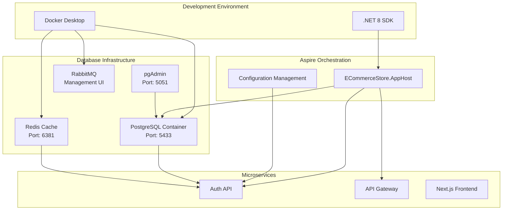
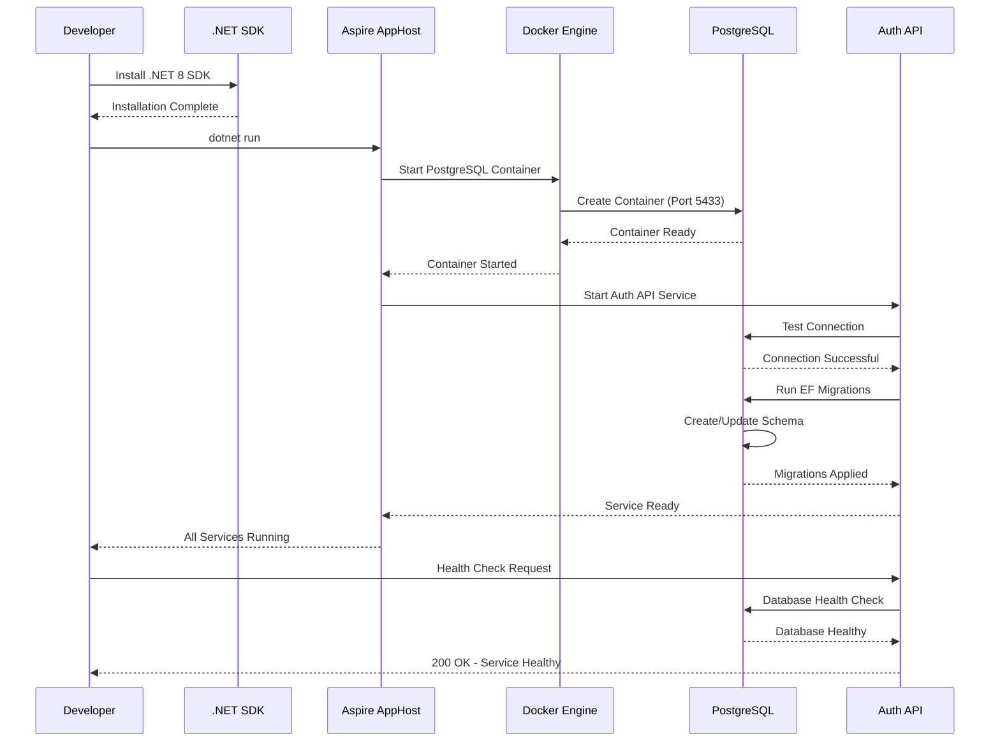

# Database Connection Fix - Design Document

## Architecture Overview

The database connection fix involves establishing a reliable connection pipeline between the .NET microservices and PostgreSQL database through proper SDK installation, container orchestration, and configuration management.

### System Architecture Diagram



## Component Design

### 1. .NET SDK Installation

**Purpose**: Enable .NET application execution and development tools

**Implementation**:
- Download .NET 8 SDK from Microsoft official site
- Install with default configuration
- Verify PATH environment variable inclusion
- Test with `dotnet --version` command

**Configuration**:
```json
{
  "sdk": {
    "version": "8.0.x",
    "rollForward": "latestMajor",
    "allowPrerelease": false
  }
}
```

### 2. Database Container Management

**Purpose**: Provide consistent PostgreSQL database environment

**Container Specification**:
```yaml
postgres:
  image: postgres:15-alpine
  container_name: ecommerce-postgres
  environment:
    POSTGRES_USER: postgres
    POSTGRES_PASSWORD: postgres
    POSTGRES_DB: ecommercedb
  ports:
    - "5433:5432"
  volumes:
    - postgres_data:/var/lib/postgresql/data
  healthcheck:
    test: ["CMD-SHELL", "pg_isready -U postgres"]
    interval: 30s
    timeout: 10s
    retries: 3
```

**Data Model Schema**:
```sql
-- Core authentication tables
CREATE SCHEMA IF NOT EXISTS auth;

CREATE TABLE auth.AspNetUsers (
    Id VARCHAR(450) PRIMARY KEY,
    UserName VARCHAR(256),
    NormalizedUserName VARCHAR(256),
    Email VARCHAR(256),
    NormalizedEmail VARCHAR(256),
    EmailConfirmed BOOLEAN NOT NULL,
    PasswordHash TEXT,
    SecurityStamp TEXT,
    ConcurrencyStamp TEXT,
    PhoneNumber TEXT,
    PhoneNumberConfirmed BOOLEAN NOT NULL,
    TwoFactorEnabled BOOLEAN NOT NULL,
    LockoutEnd TIMESTAMPTZ,
    LockoutEnabled BOOLEAN NOT NULL,
    AccessFailedCount INTEGER NOT NULL
);

CREATE TABLE auth.RefreshTokens (
    Id UUID PRIMARY KEY DEFAULT gen_random_uuid(),
    Token VARCHAR(500) NOT NULL,
    UserId VARCHAR(450) NOT NULL,
    ExpiryDate TIMESTAMPTZ NOT NULL,
    IsRevoked BOOLEAN NOT NULL DEFAULT FALSE,
    CreatedAt TIMESTAMPTZ NOT NULL DEFAULT NOW(),
    FOREIGN KEY (UserId) REFERENCES auth.AspNetUsers(Id)
);
```

### 3. Connection String Management

**Purpose**: Secure and flexible database connection configuration

**Configuration Structure**:
```json
{
  "ConnectionStrings": {
    "ecommercedb": "Host=localhost;Port=5433;Database=ecommercedb;Username=postgres;Password=postgres;Pooling=true;MinPoolSize=5;MaxPoolSize=100;ConnectionLifetime=300"
  },
  "Database": {
    "CommandTimeout": 30,
    "EnableSensitiveDataLogging": false,
    "EnableDetailedErrors": true,
    "MaxRetryCount": 3,
    "MaxRetryDelay": "00:00:30"
  }
}
```

**Entity Framework Configuration**:
```csharp
public void ConfigureServices(IServiceCollection services)
{
    services.AddDbContext<AuthDbContext>(options =>
    {
        options.UseNpgsql(connectionString, npgsqlOptions =>
        {
            npgsqlOptions.EnableRetryOnFailure(
                maxRetryCount: 3,
                maxRetryDelay: TimeSpan.FromSeconds(30),
                errorCodesToAdd: null);
            npgsqlOptions.CommandTimeout(30);
        });
        
        if (environment.IsDevelopment())
        {
            options.EnableSensitiveDataLogging();
            options.EnableDetailedErrors();
        }
    });
}
```

## Sequence Diagram



## Error Handling Strategy

### Connection Failures

**Retry Policy**:
```csharp
public class DatabaseRetryPolicy
{
    public static readonly RetryPolicy Policy = Policy
        .Handle<NpgsqlException>()
        .Or<TimeoutException>()
        .WaitAndRetryAsync(
            retryCount: 3,
            sleepDurationProvider: retryAttempt => 
                TimeSpan.FromSeconds(Math.Pow(2, retryAttempt)),
            onRetry: (outcome, timespan, retryCount, context) =>
            {
                Log.Warning("Database connection retry {RetryCount} after {Delay}ms", 
                    retryCount, timespan.TotalMilliseconds);
            });
}
```

**Circuit Breaker Pattern**:
```csharp
public class DatabaseCircuitBreaker
{
    private static readonly CircuitBreakerPolicy CircuitBreaker = Policy
        .Handle<NpgsqlException>()
        .CircuitBreakerAsync(
            handledEventsAllowedBeforeBreaking: 5,
            durationOfBreak: TimeSpan.FromMinutes(1),
            onBreak: (exception, duration) =>
            {
                Log.Error("Database circuit breaker opened for {Duration}", duration);
            },
            onReset: () =>
            {
                Log.Information("Database circuit breaker reset");
            });
}
```

### Health Checks

**Database Health Check Implementation**:
```csharp
public class DatabaseHealthCheck : IHealthCheck
{
    private readonly AuthDbContext _context;
    
    public DatabaseHealthCheck(AuthDbContext context)
    {
        _context = context;
    }
    
    public async Task<HealthCheckResult> CheckHealthAsync(
        HealthCheckContext context, 
        CancellationToken cancellationToken = default)
    {
        try
        {
            await _context.Database.CanConnectAsync(cancellationToken);
            
            var userCount = await _context.Users.CountAsync(cancellationToken);
            
            return HealthCheckResult.Healthy(
                $"Database is healthy. User count: {userCount}");
        }
        catch (Exception ex)
        {
            return HealthCheckResult.Unhealthy(
                "Database is unhealthy", ex);
        }
    }
}
```

## Security Measures

### Connection Security

**Development Environment**:
- Use basic authentication with strong passwords
- Enable SSL/TLS for production environments
- Implement connection string encryption
- Use Azure Key Vault or similar for production secrets

**Production Security**:
```json
{
  "ConnectionStrings": {
    "ecommercedb": "Host=prod-db.example.com;Port=5432;Database=ecommercedb;Username=app_user;Password=${DB_PASSWORD};SslMode=Require;TrustServerCertificate=false"
  }
}
```

### Access Control

**Database User Permissions**:
```sql
-- Create application-specific user
CREATE USER ecommerce_app WITH PASSWORD 'secure_password';

-- Grant minimal required permissions
GRANT CONNECT ON DATABASE ecommercedb TO ecommerce_app;
GRANT USAGE ON SCHEMA auth TO ecommerce_app;
GRANT SELECT, INSERT, UPDATE, DELETE ON ALL TABLES IN SCHEMA auth TO ecommerce_app;
GRANT USAGE, SELECT ON ALL SEQUENCES IN SCHEMA auth TO ecommerce_app;
```

## Deployment Strategy

### Development Deployment

**Aspire Orchestration**:
```csharp
// Program.cs in AppHost
var builder = DistributedApplication.CreateBuilder(args);

// Database with health checks
var postgres = builder.AddPostgres("postgres")
    .WithContainerName("ecommerce-postgres")
    .WithHostPort(5433)
    .WithEnvironment("POSTGRES_USER", "postgres")
    .WithEnvironment("POSTGRES_PASSWORD", "postgres")
    .WithEnvironment("POSTGRES_DB", "ecommercedb")
    .WithDataVolume()
    .WithHealthCheck();

var database = postgres.AddDatabase("ecommercedb");

// Auth API with database dependency
var authApi = builder.AddProject<Projects.ECommerceStore_Auth_Api>("auth-api")
    .WithReference(database)
    .WaitFor(database);

builder.Build().Run();
```

### Container Health Monitoring

**Docker Compose Health Checks**:
```yaml
services:
  postgres:
    image: postgres:15-alpine
    healthcheck:
      test: ["CMD-SHELL", "pg_isready -U postgres -d ecommercedb"]
      interval: 30s
      timeout: 10s
      retries: 3
      start_period: 60s
    
  auth-api:
    depends_on:
      postgres:
        condition: service_healthy
    healthcheck:
      test: ["CMD", "curl", "-f", "http://localhost:8080/health"]
      interval: 30s
      timeout: 10s
      retries: 3
```

## Testing Strategy

### Unit Tests

**Database Context Testing**:
```csharp
[Test]
public async Task DatabaseContext_ShouldConnect_Successfully()
{
    // Arrange
    var options = new DbContextOptionsBuilder<AuthDbContext>()
        .UseInMemoryDatabase(databaseName: Guid.NewGuid().ToString())
        .Options;
    
    // Act & Assert
    using var context = new AuthDbContext(options);
    var canConnect = await context.Database.CanConnectAsync();
    Assert.IsTrue(canConnect);
}
```

### Integration Tests

**Database Connection Integration Test**:
```csharp
[Test]
public async Task AuthApi_ShouldConnectToDatabase_Successfully()
{
    // Arrange
    var factory = new WebApplicationFactory<Program>()
        .WithWebHostBuilder(builder =>
        {
            builder.ConfigureTestServices(services =>
            {
                services.AddDbContext<AuthDbContext>(options =>
                    options.UseNpgsql(TestConnectionString));
            });
        });
    
    var client = factory.CreateClient();
    
    // Act
    var response = await client.GetAsync("/health");
    
    // Assert
    Assert.AreEqual(HttpStatusCode.OK, response.StatusCode);
}
```

### Performance Tests

**Connection Pool Performance**:
```csharp
[Test]
public async Task DatabaseConnectionPool_ShouldHandleConcurrentRequests()
{
    // Arrange
    const int concurrentRequests = 50;
    var tasks = new List<Task>();
    
    // Act
    for (int i = 0; i < concurrentRequests; i++)
    {
        tasks.Add(Task.Run(async () =>
        {
            using var context = new AuthDbContext(options);
            await context.Users.CountAsync();
        }));
    }
    
    // Assert
    await Task.WhenAll(tasks);
    // All tasks should complete without timeout
}
```

## Monitoring and Observability

### Logging Configuration

**Structured Logging**:
```json
{
  "Serilog": {
    "Using": ["Serilog.Sinks.Console", "Serilog.Sinks.File"],
    "MinimumLevel": {
      "Default": "Information",
      "Override": {
        "Microsoft.EntityFrameworkCore.Database.Command": "Information",
        "Microsoft.EntityFrameworkCore.Infrastructure": "Warning"
      }
    },
    "WriteTo": [
      {
        "Name": "Console",
        "Args": {
          "outputTemplate": "[{Timestamp:HH:mm:ss} {Level:u3}] {Message:lj} {Properties:j}{NewLine}{Exception}"
        }
      },
      {
        "Name": "File",
        "Args": {
          "path": "logs/database-.log",
          "rollingInterval": "Day",
          "retainedFileCountLimit": 7
        }
      }
    ]
  }
}
```

### Metrics Collection

**Database Metrics**:
```csharp
public class DatabaseMetrics
{
    private static readonly Counter ConnectionAttempts = Metrics
        .CreateCounter("database_connection_attempts_total", 
                      "Total database connection attempts");
    
    private static readonly Counter ConnectionFailures = Metrics
        .CreateCounter("database_connection_failures_total", 
                      "Total database connection failures");
    
    private static readonly Histogram QueryDuration = Metrics
        .CreateHistogram("database_query_duration_seconds", 
                        "Database query execution time");
}
```

## Performance Optimization

### Connection Pooling

**Optimal Pool Configuration**:
```json
{
  "ConnectionStrings": {
    "ecommercedb": "Host=localhost;Port=5433;Database=ecommercedb;Username=postgres;Password=postgres;Pooling=true;MinPoolSize=5;MaxPoolSize=100;ConnectionLifetime=300;ConnectionIdleLifetime=60;ConnectionPruningInterval=10"
  }
}
```

### Query Optimization

**Entity Framework Configuration**:
```csharp
protected override void OnConfiguring(DbContextOptionsBuilder optionsBuilder)
{
    optionsBuilder.UseNpgsql(connectionString, options =>
    {
        options.EnableRetryOnFailure();
        options.CommandTimeout(30);
    })
    .EnableServiceProviderCaching()
    .EnableSensitiveDataLogging(false)
    .UseQueryTrackingBehavior(QueryTrackingBehavior.NoTracking);
}
```

## Rollback Strategy

### Migration Rollback

**Safe Migration Practices**:
```bash
# Create migration
dotnet ef migrations add FixDatabaseConnection

# Apply migration
dotnet ef database update

# Rollback if needed
dotnet ef database update PreviousMigration

# Remove migration
dotnet ef migrations remove
```

### Configuration Rollback

**Backup Strategy**:
1. Create backup of current appsettings files
2. Document current container configurations
3. Export current database schema
4. Create restore scripts for quick rollback

---

**Document Version**: 1.0  
**Last Updated**: January 2025  
**Status**: Draft - Pending Approval  
**Dependencies**: Requirements Document v1.0