# Database Connection Fix - Flowchart Diagram

This flowchart diagram represents the overall process and logic of the database connection fix feature plan, showing decision points, data flows, and processing stages.

```mermaid
flowchart TD
    Start([Start: Database Connection Issue]) --> CheckSDK{Check .NET SDK}
    
    CheckSDK -->|Missing| InstallSDK[TASK-001: Install .NET 8 SDK]
    CheckSDK -->|Present| VerifyDocker[TASK-002: Verify Docker Environment]
    
    InstallSDK --> VerifySDK{Verify SDK Installation}
    VerifySDK -->|Failed| InstallSDK
    VerifySDK -->|Success| VerifyDocker
    
    VerifyDocker --> CheckDockerStatus{Docker Desktop Running?}
    CheckDockerStatus -->|No| StartDocker[Start Docker Desktop]
    CheckDockerStatus -->|Yes| CheckPorts{Port 5433 Available?}
    
    StartDocker --> CheckPorts
    CheckPorts -->|Occupied| ResolvePortConflict[Resolve Port Conflict]
    CheckPorts -->|Available| UpdateConfig[TASK-003: Update Database Configuration]
    
    ResolvePortConflict --> UpdateConfig
    
    UpdateConfig --> ReviewSettings[Review appsettings.json]
    ReviewSettings --> AddPooling[Add Connection Pooling]
    AddPooling --> ConfigRetry[Configure Retry Policies]
    ConfigRetry --> AddHealthCheck[Add Health Check Config]
    AddHealthCheck --> StartAppHost[TASK-004: Start Aspire AppHost]
    
    StartAppHost --> LaunchContainers[Launch Database Containers]
    LaunchContainers --> CheckContainerStatus{All Containers Running?}
    
    CheckContainerStatus -->|No| TroubleshootContainers[Troubleshoot Container Issues]
    TroubleshootContainers --> LaunchContainers
    CheckContainerStatus -->|Yes| RunMigrations[TASK-005: Run Database Migrations]
    
    RunMigrations --> CheckMigrations{Migrations Successful?}
    CheckMigrations -->|Failed| FixMigrationIssues[Fix Migration Issues]
    FixMigrationIssues --> RunMigrations
    CheckMigrations -->|Success| TestAuthAPI[TASK-006: Test Auth API Connection]
    
    TestAuthAPI --> StartAuthService[Start Auth API Service]
    StartAuthService --> TestConnection{Database Connection OK?}
    
    TestConnection -->|Failed| DiagnoseConnection[Diagnose Connection Issues]
    DiagnoseConnection --> FixConnectionIssues[Fix Connection Issues]
    FixConnectionIssues --> TestConnection
    TestConnection -->|Success| HealthCheck[Perform Health Check]
    
    HealthCheck --> HealthStatus{Health Check Passed?}
    HealthStatus -->|Failed| DiagnoseHealth[Diagnose Health Issues]
    DiagnoseHealth --> FixConnectionIssues
    HealthStatus -->|Passed| VerifyStack[TASK-007: Verify Complete Stack]
    
    VerifyStack --> StartFullStack[Start Complete Application Stack]
    StartFullStack --> CheckAllServices{All Services Running?}
    
    CheckAllServices -->|No| TroubleshootServices[Troubleshoot Service Issues]
    TroubleshootServices --> StartFullStack
    CheckAllServices -->|Yes| EndToEndTest[End-to-End Health Check]
    
    EndToEndTest --> E2EStatus{E2E Test Passed?}
    E2EStatus -->|Failed| DiagnoseE2E[Diagnose E2E Issues]
    DiagnoseE2E --> TroubleshootServices
    E2EStatus -->|Passed| SetupMonitoring[TASK-008: Setup Connection Monitoring]
    
    SetupMonitoring --> ConfigureLogging[Configure Structured Logging]
    ConfigureLogging --> AddMetrics[Add Connection Pool Metrics]
    AddMetrics --> CreateDashboard[Setup Health Check Dashboard]
    CreateDashboard --> CreateDocs[TASK-009: Create Documentation]
    
    CreateDocs --> DocumentConfig[Document Connection Configuration]
    DocumentConfig --> CreateTroubleshootingGuide[Create Troubleshooting Guide]
    CreateTroubleshootingGuide --> UpdateReadme[Update Project README]
    UpdateReadme --> DocumentContainers[Document Container Procedures]
    DocumentContainers --> ValidateErrors[TASK-010: Validate Error Scenarios]
    
    ValidateErrors --> SimulateFailure[Simulate Database Failure]
    SimulateFailure --> TestRetryLogic{Retry Logic Working?}
    
    TestRetryLogic -->|Failed| FixRetryLogic[Fix Retry Logic]
    FixRetryLogic --> TestRetryLogic
    TestRetryLogic -->|Success| TestRecovery[Test Automatic Recovery]
    
    TestRecovery --> RecoveryStatus{Recovery Successful?}
    RecoveryStatus -->|Failed| FixRecoveryLogic[Fix Recovery Logic]
    FixRecoveryLogic --> TestRecovery
    RecoveryStatus -->|Success| FinalValidation[Final System Validation]
    
    FinalValidation --> AllTasksComplete{All Tasks Completed?}
    AllTasksComplete -->|No| IdentifyPending[Identify Pending Tasks]
    IdentifyPending --> UpdateConfig
    AllTasksComplete -->|Yes| Success([Success: Database Connection Fixed])
    
    %% Error Handling Paths
    DiagnoseConnection --> CheckConnectionString[Check Connection String]
    CheckConnectionString --> CheckNetworking[Check Network Connectivity]
    CheckNetworking --> CheckCredentials[Verify Database Credentials]
    CheckCredentials --> CheckPermissions[Check Database Permissions]
    
    %% Monitoring Feedback Loop
    CreateDashboard --> MonitoringActive[Monitoring Active]
    MonitoringActive --> ContinuousMonitoring[Continuous Health Monitoring]
    ContinuousMonitoring --> AlertOnIssues[Alert on Connection Issues]
    
    %% Styling
    classDef taskClass fill:#e1f5fe,stroke:#01579b,stroke-width:2px
    classDef decisionClass fill:#fff3e0,stroke:#e65100,stroke-width:2px
    classDef errorClass fill:#ffebee,stroke:#c62828,stroke-width:2px
    classDef successClass fill:#e8f5e8,stroke:#2e7d32,stroke-width:2px
    
    class InstallSDK,VerifyDocker,UpdateConfig,StartAppHost,RunMigrations,TestAuthAPI,VerifyStack,SetupMonitoring,CreateDocs,ValidateErrors taskClass
    class CheckSDK,VerifySDK,CheckDockerStatus,CheckPorts,CheckContainerStatus,CheckMigrations,TestConnection,HealthStatus,CheckAllServices,E2EStatus,TestRetryLogic,RecoveryStatus,AllTasksComplete decisionClass
    class TroubleshootContainers,FixMigrationIssues,DiagnoseConnection,FixConnectionIssues,DiagnoseHealth,TroubleshootServices,DiagnoseE2E,FixRetryLogic,FixRecoveryLogic errorClass
    class Success successClass
```

