# Database Connection Fix - Sequence Diagram

This sequence diagram shows the complete end-to-end workflow for fixing the database connection issue, covering all tasks from SDK installation through final validation.

```mermaid
sequenceDiagram
    participant Dev as Developer
    participant SDK as .NET 8 SDK
    participant Docker as Docker Desktop
    participant AppHost as Aspire AppHost
    participant PG as PostgreSQL Container
    participant AuthAPI as Auth API
    participant EF as Entity Framework
    participant Monitor as Monitoring System
    
    Note over Dev,Monitor: TASK-001: Install .NET 8 SDK
    Dev->>SDK: Download and install .NET 8 SDK
    SDK-->>Dev: Installation complete
    Dev->>SDK: dotnet --version
    SDK-->>Dev: 8.0.x confirmed
    
    Note over Dev,Monitor: TASK-002: Verify Docker Environment
    Dev->>Docker: Check Docker Desktop status
    Docker-->>Dev: Docker running
    Dev->>Docker: Check port 5433 availability
    Docker-->>Dev: Port available
    Dev->>Docker: Verify system resources
    Docker-->>Dev: Resources sufficient
    
    Note over Dev,Monitor: TASK-003: Update Database Configuration
    Dev->>Dev: Review appsettings.Development.json
    Dev->>Dev: Add connection pooling parameters
    Dev->>Dev: Configure retry policies
    Dev->>Dev: Add health check configuration
    
    Note over Dev,Monitor: TASK-004: Start Aspire AppHost and Containers
    Dev->>AppHost: dotnet run (AppHost)
    AppHost->>Docker: Start PostgreSQL container
    Docker->>PG: Create container on port 5433
    PG-->>Docker: Container started
    Docker-->>AppHost: PostgreSQL ready
    
    AppHost->>Docker: Start Redis container
    Docker-->>AppHost: Redis ready
    
    AppHost->>Docker: Start RabbitMQ container
    Docker-->>AppHost: RabbitMQ ready
    
    AppHost-->>Dev: All containers running
    
    Note over Dev,Monitor: TASK-005: Run Database Migrations
    Dev->>EF: dotnet ef migrations list
    EF-->>Dev: Show pending migrations
    Dev->>EF: dotnet ef database update
    EF->>PG: Apply migrations
    PG->>PG: Create/update schema
    PG-->>EF: Schema updated
    EF-->>Dev: Migrations applied successfully
    
    Note over Dev,Monitor: TASK-006: Test Auth API Connection
    Dev->>AuthAPI: Start Auth API service
    AuthAPI->>PG: Test database connection
    PG-->>AuthAPI: Connection successful
    AuthAPI->>PG: Query user entities
    PG-->>AuthAPI: Query results
    AuthAPI-->>Dev: Service started successfully
    
    Dev->>AuthAPI: GET /health
    AuthAPI->>PG: Database health check
    PG-->>AuthAPI: Database healthy
    AuthAPI-->>Dev: 200 OK - Healthy
    
    Note over Dev,Monitor: TASK-007: Verify Complete Application Stack
    Dev->>AppHost: Start complete stack
    AppHost->>AuthAPI: Start with database reference
    AuthAPI->>PG: Establish connection pool
    PG-->>AuthAPI: Pool established
    
    AppHost->>AppHost: Start API Gateway
    AppHost->>AppHost: Start other services
    AppHost-->>Dev: Full stack running
    
    Dev->>AppHost: End-to-end health check
    AppHost->>AuthAPI: Health check
    AuthAPI->>PG: Database status
    PG-->>AuthAPI: Healthy
    AuthAPI-->>AppHost: Service healthy
    AppHost-->>Dev: All services healthy
    
    Note over Dev,Monitor: TASK-008: Implement Connection Monitoring
    Dev->>Monitor: Configure structured logging
    Monitor-->>Dev: Logging configured
    Dev->>Monitor: Add connection pool metrics
    Monitor-->>Dev: Metrics collection active
    Dev->>Monitor: Setup health check dashboard
    Monitor-->>Dev: Dashboard ready
    
    AuthAPI->>Monitor: Log connection events
    PG->>Monitor: Report connection metrics
    Monitor->>Monitor: Aggregate metrics
    
    Note over Dev,Monitor: TASK-009: Create Documentation
    Dev->>Dev: Document connection configuration
    Dev->>Dev: Create troubleshooting guide
    Dev->>Dev: Update project README
    Dev->>Dev: Document container procedures
    
    Note over Dev,Monitor: TASK-010: Validate Error Scenarios
    Dev->>Docker: Stop PostgreSQL container
    AuthAPI->>PG: Attempt connection
    PG-->>AuthAPI: Connection failed
    AuthAPI->>AuthAPI: Trigger retry logic
    AuthAPI->>Monitor: Log retry attempts
    
    Dev->>Docker: Restart PostgreSQL container
    Docker->>PG: Container restarted
    PG-->>Docker: Ready
    AuthAPI->>PG: Retry connection
    PG-->>AuthAPI: Connection restored
    AuthAPI->>Monitor: Log recovery
    
    AuthAPI-->>Dev: Service recovered automatically
    Monitor-->>Dev: All metrics normal
    
    Note over Dev,Monitor: Validation Complete
    Dev->>Dev: Verify all tasks completed
    Dev->>Monitor: Review final metrics
    Monitor-->>Dev: All systems operational
    Dev->>Dev: Database connection fix complete
```

