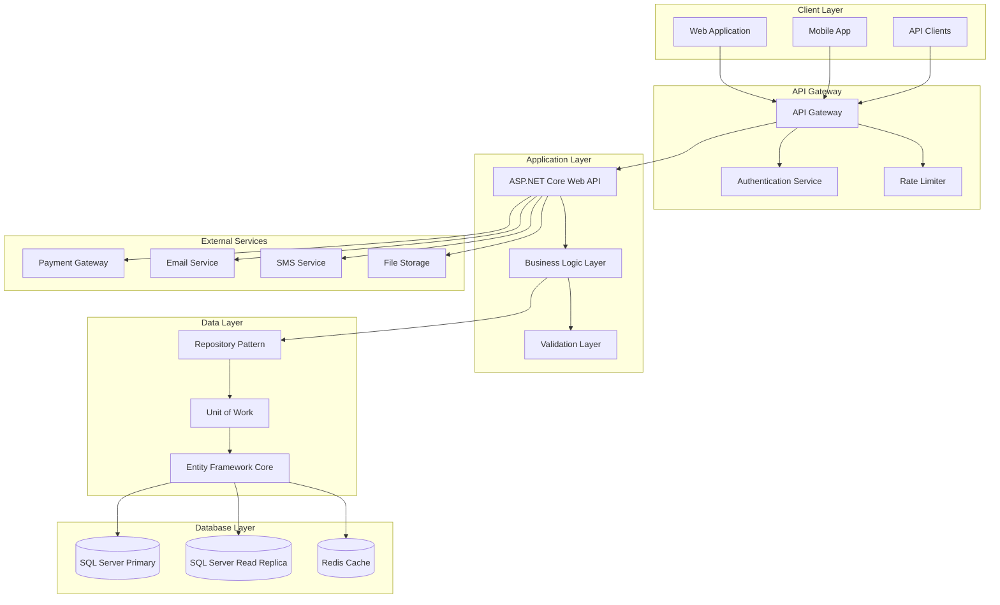
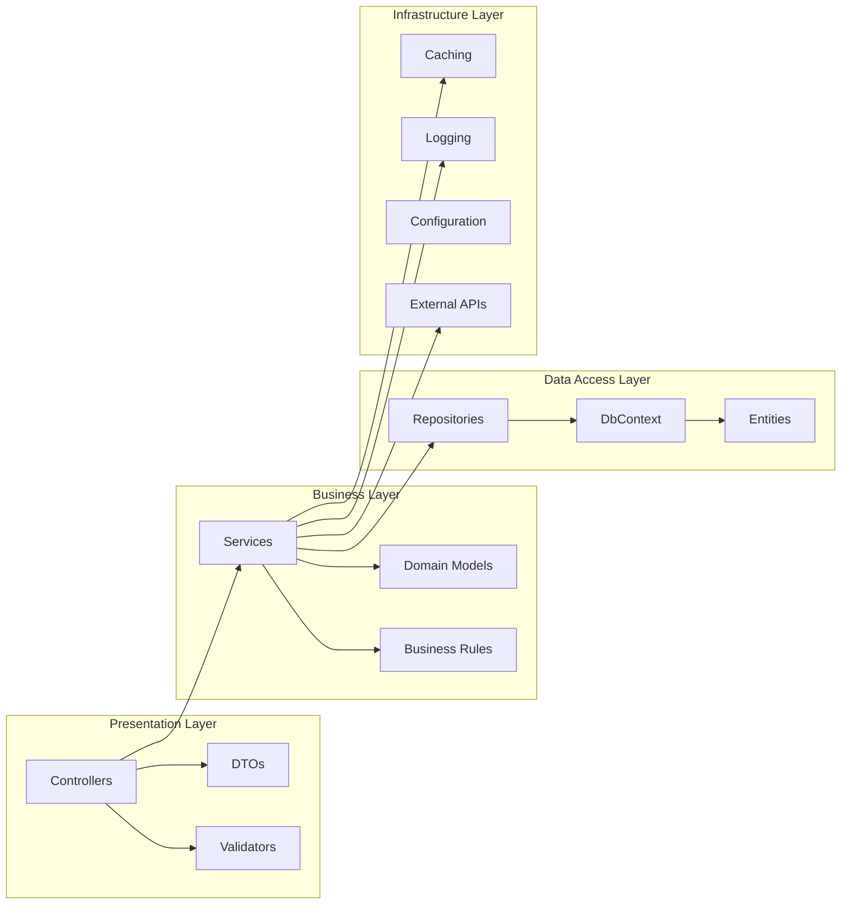
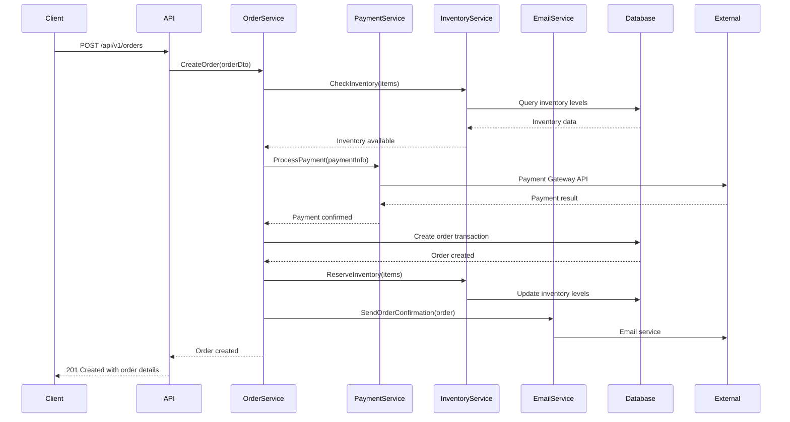

# Shopify Database Replication - System Design

## Project Overview

This document outlines the comprehensive system design for replicating Shopify's database functionality using .NET 8, Entity Framework Core 8, and SQL Server. The design follows enterprise-grade patterns and ensures scalability, security, and maintainability.

## Architecture Overview

### High-Level Architecture



### Component Architecture



## Data Model Design

### Core Entity Relationships

```mermaid
erDiagram
    SHOP {
        bigint Id PK
        string Name
        string Domain
        string Email
        string Currency
        string Timezone
        datetime CreatedAt
        datetime UpdatedAt
    }
    
    PRODUCT {
        bigint Id PK
        string Title
        string Handle UK
        string BodyHtml
        string Vendor
        string ProductType
        string Status
        string Tags
        datetime CreatedAt
        datetime UpdatedAt
    }
    
    PRODUCT_VARIANT {
        bigint Id PK
        bigint ProductId FK
        string Title
        decimal Price
        decimal CompareAtPrice
        string Sku UK
        string Barcode
        int InventoryQuantity
        string Option1
        string Option2
        string Option3
        decimal Weight
        string WeightUnit
        datetime CreatedAt
        datetime UpdatedAt
    }
    
    PRODUCT_OPTION {
        bigint Id PK
        bigint ProductId FK
        string Name
        int Position
        datetime CreatedAt
        datetime UpdatedAt
    }
    
    OPTION_VALUE {
        bigint Id PK
        bigint ProductOptionId FK
        string Value
        int Position
        datetime CreatedAt
        datetime UpdatedAt
    }
    
    CUSTOMER {
        bigint Id PK
        string Email UK
        string FirstName
        string LastName
        string Phone
        string State
        bool AcceptsMarketing
        datetime CreatedAt
        datetime UpdatedAt
    }
    
    CUSTOMER_ADDRESS {
        bigint Id PK
        bigint CustomerId FK
        string FirstName
        string LastName
        string Company
        string Address1
        string Address2
        string City
        string Province
        string Country
        string Zip
        string Phone
        bool IsDefault
        datetime CreatedAt
        datetime UpdatedAt
    }
    
    ORDER {
        bigint Id PK
        bigint CustomerId FK
        string Email
        string Number UK
        decimal TotalPrice
        decimal SubtotalPrice
        decimal TotalTax
        string Currency
        string FinancialStatus
        string FulfillmentStatus
        datetime ProcessedAt
        datetime CreatedAt
        datetime UpdatedAt
    }
    
    ORDER_LINE_ITEM {
        bigint Id PK
        bigint OrderId FK
        bigint ProductVariantId FK
        string Title
        int Quantity
        decimal Price
        string Sku
        datetime CreatedAt
        datetime UpdatedAt
    }
    
    INVENTORY_ITEM {
        bigint Id PK
        bigint ProductVariantId FK
        string Sku UK
        decimal Cost
        bool Tracked
        string CountryCodeOfOrigin
        datetime CreatedAt
        datetime UpdatedAt
    }
    
    INVENTORY_LEVEL {
        bigint Id PK
        bigint InventoryItemId FK
        bigint LocationId FK
        int Available
        datetime UpdatedAt
    }
    
    LOCATION {
        bigint Id PK
        string Name
        string Address1
        string Address2
        string City
        string Province
        string Country
        string Zip
        string Phone
        bool Active
        datetime CreatedAt
        datetime UpdatedAt
    }
    
    PRODUCT_TAG {
        bigint Id PK
        bigint ProductId FK
        string Tag
        datetime CreatedAt
    }
    
    CUSTOMER_GROUP {
        bigint Id PK
        string Name
        string Description
        decimal DiscountPercentage
        datetime CreatedAt
        datetime UpdatedAt
    }
    
    CUSTOMER_TAG {
        bigint Id PK
        bigint CustomerId FK
        string Tag
        datetime CreatedAt
    }
    
    ORDER_TRANSACTION {
        bigint Id PK
        bigint OrderId FK
        string Kind
        string Gateway
        string Status
        decimal Amount
        string Currency
        string AuthorizationCode
        string TransactionId
        datetime ProcessedAt
        datetime CreatedAt
    }
    
    ORDER_FULFILLMENT {
        bigint Id PK
        bigint OrderId FK
        string Status
        string TrackingCompany
        string TrackingNumber
        string TrackingUrl
        datetime ShippedAt
        datetime CreatedAt
        datetime UpdatedAt
    }
    
    ORDER_REFUND {
        bigint Id PK
        bigint OrderId FK
        decimal Amount
        string Currency
        string Reason
        string Note
        datetime ProcessedAt
        datetime CreatedAt
    }
    
    ABANDONED_CHECKOUT {
        bigint Id PK
        bigint CustomerId FK
        string Email
        decimal TotalPrice
        string Currency
        datetime AbandonedAt
        datetime RecoveredAt
        datetime CreatedAt
    }
    
    INVENTORY_ADJUSTMENT {
        bigint Id PK
        bigint InventoryItemId FK
        bigint LocationId FK
        int QuantityAdjustment
        string Reason
        string Note
        datetime CreatedAt
    }
    
    PAYMENT {
        bigint Id PK
        bigint OrderId FK
        string Gateway
        string Status
        decimal Amount
        string Currency
        string PaymentMethod
        string TransactionId
        datetime ProcessedAt
        datetime CreatedAt
    }
    
    TRANSACTION {
        bigint Id PK
        bigint PaymentId FK
        string Type
        string Status
        decimal Amount
        string Currency
        string Reference
        datetime ProcessedAt
        datetime CreatedAt
    }
    
    REFUND {
        bigint Id PK
        bigint PaymentId FK
        decimal Amount
        string Currency
        string Reason
        string Status
        datetime ProcessedAt
        datetime CreatedAt
    }
    
    GIFT_CARD {
        bigint Id PK
        string Code UK
        decimal InitialValue
        decimal Balance
        string Currency
        string Status
        bigint CustomerId FK
        datetime ExpiresAt
        datetime CreatedAt
        datetime UpdatedAt
    }
    
    DISCOUNT_CODE {
        bigint Id PK
        string Code UK
        string Type
        decimal Value
        decimal MinimumAmount
        int UsageLimit
        int UsedCount
        datetime StartsAt
        datetime EndsAt
        datetime CreatedAt
        datetime UpdatedAt
    }
    
    SHIPPING_ZONE {
        bigint Id PK
        string Name
        string Countries
        datetime CreatedAt
        datetime UpdatedAt
    }
    
    SHIPPING_RATE {
        bigint Id PK
        bigint ShippingZoneId FK
        string Name
        decimal Price
        string Currency
        decimal MinWeight
        decimal MaxWeight
        datetime CreatedAt
        datetime UpdatedAt
    }
    
    FULFILLMENT_SERVICE {
        bigint Id PK
        string Name
        string Handle UK
        string ServiceType
        string Format
        bool InventoryManagement
        bool TrackingSupport
        datetime CreatedAt
        datetime UpdatedAt
    }
    
    METAFIELD {
        bigint Id PK
        bigint OwnerId
        string OwnerResource
        string Namespace
        string Key
        nvarchar(max) Value
        string Type
        string Description
        datetime CreatedAt
        datetime UpdatedAt
    }
    
    METAFIELD_DEFINITION {
        bigint Id PK
        string OwnerType
        string Namespace
        string Key
        string Name
        string Type
        string Description
        nvarchar(max) Validations
        nvarchar(max) Access
        nvarchar(max) Capabilities
        datetime CreatedAt
        datetime UpdatedAt
    }
    
    SMART_COLLECTION {
        bigint Id PK
        string Title
        string Handle UK
        nvarchar(max) Rules
        bool DisjunctiveRules
        string SortOrder
        string TemplateSuffix
        datetime PublishedAt
        datetime CreatedAt
        datetime UpdatedAt
    }
    
    TRANSACTION {
        bigint Id PK
        bigint OrderId FK
        string Kind
        string Gateway
        string Status
        string Message
        datetime CreatedAt
        bool Test
        string Authorization
        bigint LocationId FK
        bigint UserId FK
        bigint ParentId FK
        datetime ProcessedAt
        string DeviceId
        string ErrorCode
        string SourceName
        nvarchar(max) PaymentDetails
        nvarchar(max) Receipt
        nvarchar(max) CurrencyExchangeAdjustment
    }
    
    REFUND {
        bigint Id PK
        bigint OrderId FK
        datetime CreatedAt
        string Note
        bigint UserId FK
        datetime ProcessedAt
        bool Restock
        nvarchar(max) Duties
        nvarchar(max) AdditionalFees
        nvarchar(max) TotalDutiesSet
    }
    
    REFUND_LINE_ITEM {
        bigint Id PK
        bigint RefundId FK
        bigint LineItemId FK
        int Quantity
        string RestockType
        bigint LocationId FK
        nvarchar(max) SubtotalSet
        nvarchar(max) TotalTaxSet
    }
    
    FULFILLMENT {
        bigint Id PK
        bigint OrderId FK
        string Status
        datetime CreatedAt
        datetime UpdatedAt
        string TrackingCompany
        nvarchar(max) TrackingNumbers
        nvarchar(max) TrackingUrls
        nvarchar(max) Receipt
        string Name
        bigint LocationId FK
        string ShipmentStatus
        string Service
        string VariantInventoryManagement
        nvarchar(max) OriginAddress
        nvarchar(max) Destination
    }
    
    FULFILLMENT_LINE_ITEM {
        bigint Id PK
        bigint FulfillmentId FK
        bigint LineItemId FK
        int Quantity
    }
    
    ABANDONED_CHECKOUT {
        bigint Id PK
        string Token UK
        string CartToken
        string Email
        string Gateway
        bool BuyerAcceptsMarketing
        datetime CreatedAt
        datetime UpdatedAt
        string LandingSite
        string Note
        string ReferringSite
        nvarchar(max) ShippingAddress
        nvarchar(max) BillingAddress
        string Currency
        datetime CompletedAt
        datetime ClosedAt
        bigint UserId FK
        bigint LocationId FK
        string SourceIdentifier
        string SourceUrl
        string DeviceId
        string Phone
        string CustomerLocale
        nvarchar(max) LineItems
        string Name
        string Source
        string AbandonedCheckoutUrl
        nvarchar(max) DiscountCodes
        nvarchar(max) TaxLines
        string SourceName
        string PresentmentCurrency
        bool BuyerAcceptsSmsMarketing
        string SmsMarketingPhone
        decimal TotalDiscounts
        decimal TotalLineItemsPrice
        decimal TotalPrice
        decimal TotalTax
        decimal TotalWeight
        bool TaxesIncluded
        decimal TotalDuties
        decimal SubtotalPrice
        bool TaxExempt
        nvarchar(max) AppliedDiscount
        nvarchar(max) ShippingLine
        bigint CustomerId FK
    }
    
    FULFILLMENT_ORDER {
        bigint Id PK
        bigint OrderId FK
        bigint FulfillmentServiceId FK
        string Status
        string Destination
        datetime RequestedAt
        datetime FulfilledAt
        datetime CreatedAt
        datetime UpdatedAt
    }
    
    SHOP {
        bigint Id PK
        string Name
        string Domain UK
        string Email
        string Currency
        string Timezone
        string Country
        string Province
        string Address1
        string Address2
        string City
        string Zip
        string Phone
        bool SetupRequired
        datetime CreatedAt
        datetime UpdatedAt
    }
    
    USER {
        bigint Id PK
        string Email UK
        string FirstName
        string LastName
        string Phone
        string Role
        bool Active
        datetime LastLoginAt
        datetime CreatedAt
        datetime UpdatedAt
    }
    
    PERMISSION {
        bigint Id PK
        string Name UK
        string Description
        string Resource
        string Action
        datetime CreatedAt
    }
    
    USER_PERMISSION {
        bigint Id PK
        bigint UserId FK
        bigint PermissionId FK
        datetime GrantedAt
        datetime ExpiresAt
    }
    
    WEBHOOK {
        bigint Id PK
        string Topic
        string Address
        string Format
        bool Active
        datetime CreatedAt
        datetime UpdatedAt
    }
    
    EVENT {
        bigint Id PK
        string Topic
        string Verb
        string Subject
        string Body
        datetime CreatedAt
    }
    
    PRODUCT ||--o{ PRODUCT_VARIANT : "has variants"
    PRODUCT ||--o{ PRODUCT_OPTION : "has options"
    PRODUCT ||--o{ PRODUCT_TAG : "has tags"
    PRODUCT_OPTION ||--o{ OPTION_VALUE : "has values"
    PRODUCT_VARIANT ||--|| INVENTORY_ITEM : "tracks inventory"
    
    CUSTOMER ||--o{ CUSTOMER_ADDRESS : "has addresses"
    CUSTOMER ||--o{ CUSTOMER_TAG : "has tags"
    CUSTOMER ||--o{ ORDER : "places orders"
    CUSTOMER ||--o{ ABANDONED_CHECKOUT : "abandons checkouts"
    CUSTOMER ||--o{ GIFT_CARD : "owns gift cards"
    CUSTOMER_GROUP ||--o{ CUSTOMER : "contains customers"
    
    ORDER ||--o{ ORDER_LINE_ITEM : "contains items"
    ORDER ||--o{ ORDER_TRANSACTION : "has transactions"
    ORDER ||--o{ ORDER_FULFILLMENT : "has fulfillments"
    ORDER ||--o{ ORDER_REFUND : "has refunds"
    ORDER ||--o{ PAYMENT : "has payments"
    ORDER ||--o{ FULFILLMENT_ORDER : "has fulfillment orders"
    PRODUCT_VARIANT ||--o{ ORDER_LINE_ITEM : "ordered as"
    
    INVENTORY_ITEM ||--o{ INVENTORY_LEVEL : "tracked at"
    INVENTORY_ITEM ||--o{ INVENTORY_ADJUSTMENT : "has adjustments"
    LOCATION ||--o{ INVENTORY_LEVEL : "stores inventory"
    LOCATION ||--o{ INVENTORY_ADJUSTMENT : "location adjustments"
    
    PAYMENT ||--o{ TRANSACTION : "has transactions"
    PAYMENT ||--o{ REFUND : "has refunds"
    
    SHIPPING_ZONE ||--o{ SHIPPING_RATE : "has rates"
    
    FULFILLMENT_SERVICE ||--o{ FULFILLMENT_ORDER : "fulfills orders"
    
    USER ||--o{ USER_PERMISSION : "has permissions"
    PERMISSION ||--o{ USER_PERMISSION : "granted to users"
```



### Database Schema Design

#### Products Schema
```sql
-- Products table with optimized indexing
CREATE TABLE Products (
    Id BIGINT IDENTITY(1,1) PRIMARY KEY,
    Title NVARCHAR(255) NOT NULL,
    Handle NVARCHAR(255) NOT NULL UNIQUE,
    BodyHtml NVARCHAR(MAX),
    Vendor NVARCHAR(255),
    ProductType NVARCHAR(255),
    Status NVARCHAR(50) NOT NULL DEFAULT 'draft',
    Tags NVARCHAR(MAX),
    CreatedAt DATETIME2 NOT NULL DEFAULT GETUTCDATE(),
    UpdatedAt DATETIME2 NOT NULL DEFAULT GETUTCDATE(),
    
    INDEX IX_Products_Handle (Handle),
    INDEX IX_Products_Vendor (Vendor),
    INDEX IX_Products_ProductType (ProductType),
    INDEX IX_Products_Status (Status),
    INDEX IX_Products_CreatedAt (CreatedAt),
    INDEX IX_Products_UpdatedAt (UpdatedAt)
);

-- Product variants with comprehensive indexing
CREATE TABLE ProductVariants (
    Id BIGINT IDENTITY(1,1) PRIMARY KEY,
    ProductId BIGINT NOT NULL,
    Title NVARCHAR(255) NOT NULL,
    Price DECIMAL(10,2) NOT NULL,
    CompareAtPrice DECIMAL(10,2),
    Sku NVARCHAR(255) UNIQUE,
    Barcode NVARCHAR(255),
    InventoryQuantity INT NOT NULL DEFAULT 0,
    Option1 NVARCHAR(255),
    Option2 NVARCHAR(255),
    Option3 NVARCHAR(255),
    Weight DECIMAL(8,2),
    WeightUnit NVARCHAR(10) DEFAULT 'kg',
    CreatedAt DATETIME2 NOT NULL DEFAULT GETUTCDATE(),
    UpdatedAt DATETIME2 NOT NULL DEFAULT GETUTCDATE(),
    
    FOREIGN KEY (ProductId) REFERENCES Products(Id) ON DELETE CASCADE,
    INDEX IX_ProductVariants_ProductId (ProductId),
    INDEX IX_ProductVariants_Sku (Sku),
    INDEX IX_ProductVariants_Price (Price),
    INDEX IX_ProductVariants_InventoryQuantity (InventoryQuantity)
);

-- Product options for variant configuration
CREATE TABLE ProductOptions (
    Id BIGINT IDENTITY(1,1) PRIMARY KEY,
    ProductId BIGINT NOT NULL,
    Name NVARCHAR(255) NOT NULL,
    Position INT NOT NULL DEFAULT 1,
    CreatedAt DATETIME2 NOT NULL DEFAULT GETUTCDATE(),
    UpdatedAt DATETIME2 NOT NULL DEFAULT GETUTCDATE(),
    
    FOREIGN KEY (ProductId) REFERENCES Products(Id) ON DELETE CASCADE,
    INDEX IX_ProductOptions_ProductId (ProductId),
    INDEX IX_ProductOptions_Position (Position)
);

-- Option values for product options
CREATE TABLE OptionValues (
    Id BIGINT IDENTITY(1,1) PRIMARY KEY,
    ProductOptionId BIGINT NOT NULL,
    Value NVARCHAR(255) NOT NULL,
    Position INT NOT NULL DEFAULT 1,
    CreatedAt DATETIME2 NOT NULL DEFAULT GETUTCDATE(),
    UpdatedAt DATETIME2 NOT NULL DEFAULT GETUTCDATE(),
    
    FOREIGN KEY (ProductOptionId) REFERENCES ProductOptions(Id) ON DELETE CASCADE,
    INDEX IX_OptionValues_ProductOptionId (ProductOptionId),
    INDEX IX_OptionValues_Position (Position)
);
```

#### Orders Schema
```sql
-- Orders table with comprehensive tracking
CREATE TABLE Orders (
    Id BIGINT IDENTITY(1,1) PRIMARY KEY,
    CustomerId BIGINT,
    Email NVARCHAR(255) NOT NULL,
    Number NVARCHAR(255) NOT NULL UNIQUE,
    TotalPrice DECIMAL(10,2) NOT NULL,
    SubtotalPrice DECIMAL(10,2) NOT NULL,
    TotalTax DECIMAL(10,2) NOT NULL DEFAULT 0,
    Currency NVARCHAR(3) NOT NULL DEFAULT 'USD',
    FinancialStatus NVARCHAR(50) NOT NULL DEFAULT 'pending',
    FulfillmentStatus NVARCHAR(50) NOT NULL DEFAULT 'unfulfilled',
    ProcessedAt DATETIME2,
    CreatedAt DATETIME2 NOT NULL DEFAULT GETUTCDATE(),
    UpdatedAt DATETIME2 NOT NULL DEFAULT GETUTCDATE(),
    
    FOREIGN KEY (CustomerId) REFERENCES Customers(Id) ON DELETE SET NULL,
    INDEX IX_Orders_CustomerId (CustomerId),
    INDEX IX_Orders_Email (Email),
    INDEX IX_Orders_Number (Number),
    INDEX IX_Orders_FinancialStatus (FinancialStatus),
    INDEX IX_Orders_FulfillmentStatus (FulfillmentStatus),
    INDEX IX_Orders_ProcessedAt (ProcessedAt),
    INDEX IX_Orders_CreatedAt (CreatedAt)
);

-- Order line items for order details
CREATE TABLE OrderLineItems (
    Id BIGINT IDENTITY(1,1) PRIMARY KEY,
    OrderId BIGINT NOT NULL,
    ProductVariantId BIGINT,
    Title NVARCHAR(255) NOT NULL,
    Quantity INT NOT NULL,
    Price DECIMAL(10,2) NOT NULL,
    Sku NVARCHAR(255),
    CreatedAt DATETIME2 NOT NULL DEFAULT GETUTCDATE(),
    UpdatedAt DATETIME2 NOT NULL DEFAULT GETUTCDATE(),
    
    FOREIGN KEY (OrderId) REFERENCES Orders(Id) ON DELETE CASCADE,
    FOREIGN KEY (ProductVariantId) REFERENCES ProductVariants(Id) ON DELETE SET NULL,
    INDEX IX_OrderLineItems_OrderId (OrderId),
    INDEX IX_OrderLineItems_ProductVariantId (ProductVariantId),
    INDEX IX_OrderLineItems_Sku (Sku)
);
```

#### Inventory Schema
```sql
-- Locations for inventory management
CREATE TABLE Locations (
    Id BIGINT IDENTITY(1,1) PRIMARY KEY,
    Name NVARCHAR(255) NOT NULL,
    Address1 NVARCHAR(255),
    Address2 NVARCHAR(255),
    City NVARCHAR(255),
    Province NVARCHAR(255),
    Country NVARCHAR(255),
    Zip NVARCHAR(50),
    Phone NVARCHAR(50),
    Active BIT NOT NULL DEFAULT 1,
    CreatedAt DATETIME2 NOT NULL DEFAULT GETUTCDATE(),
    UpdatedAt DATETIME2 NOT NULL DEFAULT GETUTCDATE(),
    
    INDEX IX_Locations_Name (Name),
    INDEX IX_Locations_Country (Country),
    INDEX IX_Locations_Active (Active)
);

-- Inventory items for stock tracking
CREATE TABLE InventoryItems (
    Id BIGINT IDENTITY(1,1) PRIMARY KEY,
    ProductVariantId BIGINT NOT NULL,
    Sku NVARCHAR(255) UNIQUE,
    Cost DECIMAL(10,2),
    Tracked BIT NOT NULL DEFAULT 1,
    CountryCodeOfOrigin NVARCHAR(3),
    CreatedAt DATETIME2 NOT NULL DEFAULT GETUTCDATE(),
    UpdatedAt DATETIME2 NOT NULL DEFAULT GETUTCDATE(),
    
    FOREIGN KEY (ProductVariantId) REFERENCES ProductVariants(Id) ON DELETE CASCADE,
    INDEX IX_InventoryItems_ProductVariantId (ProductVariantId),
    INDEX IX_InventoryItems_Sku (Sku),
    INDEX IX_InventoryItems_Tracked (Tracked)
);

-- Inventory levels for location-based stock
CREATE TABLE InventoryLevels (
    Id BIGINT IDENTITY(1,1) PRIMARY KEY,
    InventoryItemId BIGINT NOT NULL,
    LocationId BIGINT NOT NULL,
    Available INT NOT NULL DEFAULT 0,
    UpdatedAt DATETIME2 NOT NULL DEFAULT GETUTCDATE(),
    
    FOREIGN KEY (InventoryItemId) REFERENCES InventoryItems(Id) ON DELETE CASCADE,
    FOREIGN KEY (LocationId) REFERENCES Locations(Id) ON DELETE CASCADE,
    INDEX IX_InventoryLevels_InventoryItemId (InventoryItemId),
    INDEX IX_InventoryLevels_LocationId (LocationId),
    UNIQUE INDEX UX_InventoryLevels_InventoryItemId_LocationId (InventoryItemId, LocationId)
);
```

#### Customers Schema
```sql
-- Customers table with privacy considerations
CREATE TABLE Customers (
    Id BIGINT IDENTITY(1,1) PRIMARY KEY,
    Email NVARCHAR(255) NOT NULL UNIQUE,
    FirstName NVARCHAR(255),
    LastName NVARCHAR(255),
    Phone NVARCHAR(50),
    State NVARCHAR(50) NOT NULL DEFAULT 'enabled',
    AcceptsMarketing BIT NOT NULL DEFAULT 0,
    CreatedAt DATETIME2 NOT NULL DEFAULT GETUTCDATE(),
    UpdatedAt DATETIME2 NOT NULL DEFAULT GETUTCDATE(),
    
    INDEX IX_Customers_Email (Email),
    INDEX IX_Customers_Phone (Phone),
    INDEX IX_Customers_State (State),
    INDEX IX_Customers_CreatedAt (CreatedAt)
);

-- Customer addresses with geographic indexing
CREATE TABLE CustomerAddresses (
    Id BIGINT IDENTITY(1,1) PRIMARY KEY,
    CustomerId BIGINT NOT NULL,
    FirstName NVARCHAR(255),
    LastName NVARCHAR(255),
    Company NVARCHAR(255),
    Address1 NVARCHAR(255) NOT NULL,
    Address2 NVARCHAR(255),
    City NVARCHAR(255) NOT NULL,
    Province NVARCHAR(255),
    Country NVARCHAR(255) NOT NULL,
    Zip NVARCHAR(50),
    Phone NVARCHAR(50),
    IsDefault BIT NOT NULL DEFAULT 0,
    CreatedAt DATETIME2 NOT NULL DEFAULT GETUTCDATE(),
    UpdatedAt DATETIME2 NOT NULL DEFAULT GETUTCDATE(),
    
    FOREIGN KEY (CustomerId) REFERENCES Customers(Id) ON DELETE CASCADE,
    INDEX IX_CustomerAddresses_CustomerId (CustomerId),
    INDEX IX_CustomerAddresses_Country (Country),
    INDEX IX_CustomerAddresses_Province (Province),
    INDEX IX_CustomerAddresses_IsDefault (IsDefault)
);

-- Product tags for categorization
CREATE TABLE ProductTags (
    Id BIGINT IDENTITY(1,1) PRIMARY KEY,
    ProductId BIGINT NOT NULL,
    Tag NVARCHAR(255) NOT NULL,
    CreatedAt DATETIME2 NOT NULL DEFAULT GETUTCDATE(),
    
    FOREIGN KEY (ProductId) REFERENCES Products(Id) ON DELETE CASCADE,
    INDEX IX_ProductTags_ProductId (ProductId),
    INDEX IX_ProductTags_Tag (Tag),
    UNIQUE INDEX UX_ProductTags_ProductId_Tag (ProductId, Tag)
);

-- Customer groups for segmentation
CREATE TABLE CustomerGroups (
    Id BIGINT IDENTITY(1,1) PRIMARY KEY,
    Name NVARCHAR(255) NOT NULL UNIQUE,
    Description NVARCHAR(MAX),
    DiscountPercentage DECIMAL(5,2) DEFAULT 0,
    CreatedAt DATETIME2 NOT NULL DEFAULT GETUTCDATE(),
    UpdatedAt DATETIME2 NOT NULL DEFAULT GETUTCDATE(),
    
    INDEX IX_CustomerGroups_Name (Name)
);

-- Customer tags for flexible categorization
CREATE TABLE CustomerTags (
    Id BIGINT IDENTITY(1,1) PRIMARY KEY,
    CustomerId BIGINT NOT NULL,
    Tag NVARCHAR(255) NOT NULL,
    CreatedAt DATETIME2 NOT NULL DEFAULT GETUTCDATE(),
    
    FOREIGN KEY (CustomerId) REFERENCES Customers(Id) ON DELETE CASCADE,
    INDEX IX_CustomerTags_CustomerId (CustomerId),
    INDEX IX_CustomerTags_Tag (Tag),
    UNIQUE INDEX UX_CustomerTags_CustomerId_Tag (CustomerId, Tag)
);

-- Order transactions for payment tracking
CREATE TABLE OrderTransactions (
    Id BIGINT IDENTITY(1,1) PRIMARY KEY,
    OrderId BIGINT NOT NULL,
    Kind NVARCHAR(50) NOT NULL, -- authorization, capture, sale, void, refund
    Gateway NVARCHAR(100) NOT NULL,
    Status NVARCHAR(50) NOT NULL, -- pending, success, failure, error
    Amount DECIMAL(10,2) NOT NULL,
    Currency NVARCHAR(3) NOT NULL,
    AuthorizationCode NVARCHAR(255),
    TransactionId NVARCHAR(255),
    ProcessedAt DATETIME2,
    CreatedAt DATETIME2 NOT NULL DEFAULT GETUTCDATE(),
    
    FOREIGN KEY (OrderId) REFERENCES Orders(Id) ON DELETE CASCADE,
    INDEX IX_OrderTransactions_OrderId (OrderId),
    INDEX IX_OrderTransactions_Gateway (Gateway),
    INDEX IX_OrderTransactions_Status (Status),
    INDEX IX_OrderTransactions_TransactionId (TransactionId)
);

-- Order fulfillments for shipping tracking
CREATE TABLE OrderFulfillments (
    Id BIGINT IDENTITY(1,1) PRIMARY KEY,
    OrderId BIGINT NOT NULL,
    Status NVARCHAR(50) NOT NULL DEFAULT 'pending',
    TrackingCompany NVARCHAR(255),
    TrackingNumber NVARCHAR(255),
    TrackingUrl NVARCHAR(500),
    ShippedAt DATETIME2,
    CreatedAt DATETIME2 NOT NULL DEFAULT GETUTCDATE(),
    UpdatedAt DATETIME2 NOT NULL DEFAULT GETUTCDATE(),
    
    FOREIGN KEY (OrderId) REFERENCES Orders(Id) ON DELETE CASCADE,
    INDEX IX_OrderFulfillments_OrderId (OrderId),
    INDEX IX_OrderFulfillments_Status (Status),
    INDEX IX_OrderFulfillments_TrackingNumber (TrackingNumber)
);

-- Order refunds for return processing
CREATE TABLE OrderRefunds (
    Id BIGINT IDENTITY(1,1) PRIMARY KEY,
    OrderId BIGINT NOT NULL,
    Amount DECIMAL(10,2) NOT NULL,
    Currency NVARCHAR(3) NOT NULL,
    Reason NVARCHAR(255),
    Note NVARCHAR(MAX),
    ProcessedAt DATETIME2,
    CreatedAt DATETIME2 NOT NULL DEFAULT GETUTCDATE(),
    
    FOREIGN KEY (OrderId) REFERENCES Orders(Id) ON DELETE CASCADE,
    INDEX IX_OrderRefunds_OrderId (OrderId),
    INDEX IX_OrderRefunds_ProcessedAt (ProcessedAt)
);

-- Abandoned checkouts for recovery campaigns
CREATE TABLE AbandonedCheckouts (
    Id BIGINT IDENTITY(1,1) PRIMARY KEY,
    CustomerId BIGINT,
    Email NVARCHAR(255) NOT NULL,
    TotalPrice DECIMAL(10,2) NOT NULL,
    Currency NVARCHAR(3) NOT NULL,
    AbandonedAt DATETIME2 NOT NULL,
    RecoveredAt DATETIME2,
    CreatedAt DATETIME2 NOT NULL DEFAULT GETUTCDATE(),
    
    FOREIGN KEY (CustomerId) REFERENCES Customers(Id) ON DELETE SET NULL,
    INDEX IX_AbandonedCheckouts_CustomerId (CustomerId),
    INDEX IX_AbandonedCheckouts_Email (Email),
    INDEX IX_AbandonedCheckouts_AbandonedAt (AbandonedAt)
);

-- Inventory adjustments for stock management
CREATE TABLE InventoryAdjustments (
    Id BIGINT IDENTITY(1,1) PRIMARY KEY,
    InventoryItemId BIGINT NOT NULL,
    LocationId BIGINT NOT NULL,
    QuantityAdjustment INT NOT NULL,
    Reason NVARCHAR(255),
    Note NVARCHAR(MAX),
    CreatedAt DATETIME2 NOT NULL DEFAULT GETUTCDATE(),
    
    FOREIGN KEY (InventoryItemId) REFERENCES InventoryItems(Id) ON DELETE CASCADE,
    FOREIGN KEY (LocationId) REFERENCES Locations(Id) ON DELETE CASCADE,
    INDEX IX_InventoryAdjustments_InventoryItemId (InventoryItemId),
    INDEX IX_InventoryAdjustments_LocationId (LocationId),
    INDEX IX_InventoryAdjustments_CreatedAt (CreatedAt)
);

-- Payments for financial tracking
CREATE TABLE Payments (
    Id BIGINT IDENTITY(1,1) PRIMARY KEY,
    OrderId BIGINT NOT NULL,
    Gateway NVARCHAR(100) NOT NULL,
    Status NVARCHAR(50) NOT NULL,
    Amount DECIMAL(10,2) NOT NULL,
    Currency NVARCHAR(3) NOT NULL,
    PaymentMethod NVARCHAR(100),
    TransactionId NVARCHAR(255),
    ProcessedAt DATETIME2,
    CreatedAt DATETIME2 NOT NULL DEFAULT GETUTCDATE(),
    
    FOREIGN KEY (OrderId) REFERENCES Orders(Id) ON DELETE CASCADE,
    INDEX IX_Payments_OrderId (OrderId),
    INDEX IX_Payments_Gateway (Gateway),
    INDEX IX_Payments_Status (Status),
    INDEX IX_Payments_TransactionId (TransactionId)
);

-- Transactions for detailed payment tracking
CREATE TABLE Transactions (
    Id BIGINT IDENTITY(1,1) PRIMARY KEY,
    PaymentId BIGINT NOT NULL,
    Type NVARCHAR(50) NOT NULL, -- charge, refund, adjustment
    Status NVARCHAR(50) NOT NULL,
    Amount DECIMAL(10,2) NOT NULL,
    Currency NVARCHAR(3) NOT NULL,
    Reference NVARCHAR(255),
    ProcessedAt DATETIME2,
    CreatedAt DATETIME2 NOT NULL DEFAULT GETUTCDATE(),
    
    FOREIGN KEY (PaymentId) REFERENCES Payments(Id) ON DELETE CASCADE,
    INDEX IX_Transactions_PaymentId (PaymentId),
    INDEX IX_Transactions_Type (Type),
    INDEX IX_Transactions_Status (Status)
);

-- Refunds for payment reversals
CREATE TABLE Refunds (
    Id BIGINT IDENTITY(1,1) PRIMARY KEY,
    PaymentId BIGINT NOT NULL,
    Amount DECIMAL(10,2) NOT NULL,
    Currency NVARCHAR(3) NOT NULL,
    Reason NVARCHAR(255),
    Status NVARCHAR(50) NOT NULL,
    ProcessedAt DATETIME2,
    CreatedAt DATETIME2 NOT NULL DEFAULT GETUTCDATE(),
    
    FOREIGN KEY (PaymentId) REFERENCES Payments(Id) ON DELETE CASCADE,
    INDEX IX_Refunds_PaymentId (PaymentId),
    INDEX IX_Refunds_Status (Status)
);

-- Gift cards for customer loyalty
CREATE TABLE GiftCards (
    Id BIGINT IDENTITY(1,1) PRIMARY KEY,
    Code NVARCHAR(255) NOT NULL UNIQUE,
    InitialValue DECIMAL(10,2) NOT NULL,
    Balance DECIMAL(10,2) NOT NULL,
    Currency NVARCHAR(3) NOT NULL,
    Status NVARCHAR(50) NOT NULL DEFAULT 'active',
    CustomerId BIGINT,
    ExpiresAt DATETIME2,
    CreatedAt DATETIME2 NOT NULL DEFAULT GETUTCDATE(),
    UpdatedAt DATETIME2 NOT NULL DEFAULT GETUTCDATE(),
    
    FOREIGN KEY (CustomerId) REFERENCES Customers(Id) ON DELETE SET NULL,
    INDEX IX_GiftCards_Code (Code),
    INDEX IX_GiftCards_CustomerId (CustomerId),
    INDEX IX_GiftCards_Status (Status)
);

-- Discount codes for promotions
CREATE TABLE DiscountCodes (
    Id BIGINT IDENTITY(1,1) PRIMARY KEY,
    Code NVARCHAR(255) NOT NULL UNIQUE,
    Type NVARCHAR(50) NOT NULL, -- percentage, fixed_amount, free_shipping
    Value DECIMAL(10,2) NOT NULL,
    MinimumAmount DECIMAL(10,2),
    UsageLimit INT,
    UsedCount INT NOT NULL DEFAULT 0,
    StartsAt DATETIME2,
    EndsAt DATETIME2,
    CreatedAt DATETIME2 NOT NULL DEFAULT GETUTCDATE(),
    UpdatedAt DATETIME2 NOT NULL DEFAULT GETUTCDATE(),
    
    INDEX IX_DiscountCodes_Code (Code),
    INDEX IX_DiscountCodes_Type (Type),
    INDEX IX_DiscountCodes_StartsAt (StartsAt),
    INDEX IX_DiscountCodes_EndsAt (EndsAt)
);

-- Shipping zones for geographic shipping rules
CREATE TABLE ShippingZones (
    Id BIGINT IDENTITY(1,1) PRIMARY KEY,
    Name NVARCHAR(255) NOT NULL,
    Countries NVARCHAR(MAX), -- JSON array of country codes
    CreatedAt DATETIME2 NOT NULL DEFAULT GETUTCDATE(),
    UpdatedAt DATETIME2 NOT NULL DEFAULT GETUTCDATE(),
    
    INDEX IX_ShippingZones_Name (Name)
);

-- Shipping rates for zone-based pricing
CREATE TABLE ShippingRates (
    Id BIGINT IDENTITY(1,1) PRIMARY KEY,
    ShippingZoneId BIGINT NOT NULL,
    Name NVARCHAR(255) NOT NULL,
    Price DECIMAL(10,2) NOT NULL,
    Currency NVARCHAR(3) NOT NULL,
    MinWeight DECIMAL(8,2),
    MaxWeight DECIMAL(8,2),
    CreatedAt DATETIME2 NOT NULL DEFAULT GETUTCDATE(),
    UpdatedAt DATETIME2 NOT NULL DEFAULT GETUTCDATE(),
    
    FOREIGN KEY (ShippingZoneId) REFERENCES ShippingZones(Id) ON DELETE CASCADE,
    INDEX IX_ShippingRates_ShippingZoneId (ShippingZoneId),
    INDEX IX_ShippingRates_Price (Price)
);

-- Fulfillment services for third-party logistics
CREATE TABLE FulfillmentServices (
    Id BIGINT IDENTITY(1,1) PRIMARY KEY,
    Name NVARCHAR(255) NOT NULL,
    Handle NVARCHAR(255) NOT NULL UNIQUE,
    ServiceType NVARCHAR(100) NOT NULL,
    Format NVARCHAR(50) NOT NULL,
    InventoryManagement BIT NOT NULL DEFAULT 0,
    TrackingSupport BIT NOT NULL DEFAULT 0,
    CreatedAt DATETIME2 NOT NULL DEFAULT GETUTCDATE(),
    UpdatedAt DATETIME2 NOT NULL DEFAULT GETUTCDATE(),
    
    INDEX IX_FulfillmentServices_Handle (Handle),
    INDEX IX_FulfillmentServices_ServiceType (ServiceType)
);

-- Fulfillment orders for external fulfillment
CREATE TABLE FulfillmentOrders (
    Id BIGINT IDENTITY(1,1) PRIMARY KEY,
    OrderId BIGINT NOT NULL,
    FulfillmentServiceId BIGINT NOT NULL,
    Status NVARCHAR(50) NOT NULL DEFAULT 'open',
    Destination NVARCHAR(MAX), -- JSON object with address
    RequestedAt DATETIME2,
    FulfilledAt DATETIME2,
    CreatedAt DATETIME2 NOT NULL DEFAULT GETUTCDATE(),
    UpdatedAt DATETIME2 NOT NULL DEFAULT GETUTCDATE(),
    
    FOREIGN KEY (OrderId) REFERENCES Orders(Id) ON DELETE CASCADE,
    FOREIGN KEY (FulfillmentServiceId) REFERENCES FulfillmentServices(Id),
    INDEX IX_FulfillmentOrders_OrderId (OrderId),
    INDEX IX_FulfillmentOrders_FulfillmentServiceId (FulfillmentServiceId),
    INDEX IX_FulfillmentOrders_Status (Status)
);

-- Shop configuration
CREATE TABLE Shops (
    Id BIGINT IDENTITY(1,1) PRIMARY KEY,
    Name NVARCHAR(255) NOT NULL,
    Domain NVARCHAR(255) NOT NULL UNIQUE,
    Email NVARCHAR(255) NOT NULL,
    Currency NVARCHAR(3) NOT NULL DEFAULT 'USD',
    Timezone NVARCHAR(100) NOT NULL DEFAULT 'UTC',
    Country NVARCHAR(255),
    Province NVARCHAR(255),
    Address1 NVARCHAR(255),
    Address2 NVARCHAR(255),
    City NVARCHAR(255),
    Zip NVARCHAR(50),
    Phone NVARCHAR(50),
    SetupRequired BIT NOT NULL DEFAULT 1,
    CreatedAt DATETIME2 NOT NULL DEFAULT GETUTCDATE(),
    UpdatedAt DATETIME2 NOT NULL DEFAULT GETUTCDATE(),
    
    INDEX IX_Shops_Domain (Domain)
);

-- Users for admin access
CREATE TABLE Users (
    Id BIGINT IDENTITY(1,1) PRIMARY KEY,
    Email NVARCHAR(255) NOT NULL UNIQUE,
    FirstName NVARCHAR(255),
    LastName NVARCHAR(255),
    Phone NVARCHAR(50),
    Role NVARCHAR(100) NOT NULL DEFAULT 'staff',
    Active BIT NOT NULL DEFAULT 1,
    LastLoginAt DATETIME2,
    CreatedAt DATETIME2 NOT NULL DEFAULT GETUTCDATE(),
    UpdatedAt DATETIME2 NOT NULL DEFAULT GETUTCDATE(),
    
    INDEX IX_Users_Email (Email),
    INDEX IX_Users_Role (Role),
    INDEX IX_Users_Active (Active)
);

-- Permissions for role-based access
CREATE TABLE Permissions (
    Id BIGINT IDENTITY(1,1) PRIMARY KEY,
    Name NVARCHAR(255) NOT NULL UNIQUE,
    Description NVARCHAR(MAX),
    Resource NVARCHAR(100) NOT NULL,
    Action NVARCHAR(100) NOT NULL,
    CreatedAt DATETIME2 NOT NULL DEFAULT GETUTCDATE(),
    
    INDEX IX_Permissions_Resource (Resource),
    INDEX IX_Permissions_Action (Action)
);

-- User permissions mapping
CREATE TABLE UserPermissions (
    Id BIGINT IDENTITY(1,1) PRIMARY KEY,
    UserId BIGINT NOT NULL,
    PermissionId BIGINT NOT NULL,
    GrantedAt DATETIME2 NOT NULL DEFAULT GETUTCDATE(),
    ExpiresAt DATETIME2,
    
    FOREIGN KEY (UserId) REFERENCES Users(Id) ON DELETE CASCADE,
    FOREIGN KEY (PermissionId) REFERENCES Permissions(Id) ON DELETE CASCADE,
    INDEX IX_UserPermissions_UserId (UserId),
    INDEX IX_UserPermissions_PermissionId (PermissionId),
    UNIQUE INDEX UX_UserPermissions_UserId_PermissionId (UserId, PermissionId)
);

-- Webhooks for external integrations
CREATE TABLE Webhooks (
    Id BIGINT IDENTITY(1,1) PRIMARY KEY,
    Topic NVARCHAR(255) NOT NULL,
    Address NVARCHAR(500) NOT NULL,
    Format NVARCHAR(50) NOT NULL DEFAULT 'json',
    Active BIT NOT NULL DEFAULT 1,
    CreatedAt DATETIME2 NOT NULL DEFAULT GETUTCDATE(),
    UpdatedAt DATETIME2 NOT NULL DEFAULT GETUTCDATE(),
    
    INDEX IX_Webhooks_Topic (Topic),
    INDEX IX_Webhooks_Active (Active)
);

-- Events for audit logging
CREATE TABLE Events (
    Id BIGINT IDENTITY(1,1) PRIMARY KEY,
    Topic NVARCHAR(255) NOT NULL,
    Verb NVARCHAR(50) NOT NULL,
    Subject NVARCHAR(255) NOT NULL,
    Body NVARCHAR(MAX), -- JSON payload
    CreatedAt DATETIME2 NOT NULL DEFAULT GETUTCDATE(),
    
    INDEX IX_Events_Topic (Topic),
    INDEX IX_Events_Verb (Verb),
    INDEX IX_Events_CreatedAt (CreatedAt)
);

-- Metafields for custom data storage
CREATE TABLE Metafields (
    Id BIGINT IDENTITY(1,1) PRIMARY KEY,
    OwnerId BIGINT NOT NULL,
    OwnerResource NVARCHAR(100) NOT NULL, -- products, customers, orders, etc.
    Namespace NVARCHAR(255) NOT NULL,
    [Key] NVARCHAR(255) NOT NULL,
    Value NVARCHAR(MAX),
    Type NVARCHAR(100) NOT NULL, -- single_line_text_field, multi_line_text_field, number_integer, etc.
    Description NVARCHAR(MAX),
    CreatedAt DATETIME2 NOT NULL DEFAULT GETUTCDATE(),
    UpdatedAt DATETIME2 NOT NULL DEFAULT GETUTCDATE(),
    
    INDEX IX_Metafields_OwnerId_OwnerResource (OwnerId, OwnerResource),
    INDEX IX_Metafields_Namespace ([Namespace]),
    INDEX IX_Metafields_Key ([Key]),
    UNIQUE INDEX UX_Metafields_Owner_Namespace_Key (OwnerId, OwnerResource, [Namespace], [Key])
);

-- Metafield definitions for schema validation
CREATE TABLE MetafieldDefinitions (
    Id BIGINT IDENTITY(1,1) PRIMARY KEY,
    OwnerType NVARCHAR(100) NOT NULL, -- product, customer, order, etc.
    Namespace NVARCHAR(255) NOT NULL,
    [Key] NVARCHAR(255) NOT NULL,
    Name NVARCHAR(255) NOT NULL,
    Type NVARCHAR(100) NOT NULL,
    Description NVARCHAR(MAX),
    Validations NVARCHAR(MAX), -- JSON validation rules
    Access NVARCHAR(MAX), -- JSON access permissions
    Capabilities NVARCHAR(MAX), -- JSON capabilities (smart_collection_condition, admin_filterable)
    CreatedAt DATETIME2 NOT NULL DEFAULT GETUTCDATE(),
    UpdatedAt DATETIME2 NOT NULL DEFAULT GETUTCDATE(),
    
    INDEX IX_MetafieldDefinitions_OwnerType (OwnerType),
    INDEX IX_MetafieldDefinitions_Namespace ([Namespace]),
    INDEX IX_MetafieldDefinitions_Key ([Key]),
    UNIQUE INDEX UX_MetafieldDefinitions_OwnerType_Namespace_Key (OwnerType, [Namespace], [Key])
);

-- Smart collections for automated product grouping
CREATE TABLE SmartCollections (
    Id BIGINT IDENTITY(1,1) PRIMARY KEY,
    Title NVARCHAR(255) NOT NULL,
    Handle NVARCHAR(255) NOT NULL UNIQUE,
    Rules NVARCHAR(MAX), -- JSON rules for automatic product inclusion
    DisjunctiveRules BIT NOT NULL DEFAULT 0, -- AND vs OR logic
    SortOrder NVARCHAR(100) NOT NULL DEFAULT 'manual',
    TemplateSuffix NVARCHAR(255),
    PublishedAt DATETIME2,
    CreatedAt DATETIME2 NOT NULL DEFAULT GETUTCDATE(),
    UpdatedAt DATETIME2 NOT NULL DEFAULT GETUTCDATE(),
    
    INDEX IX_SmartCollections_Handle (Handle),
    INDEX IX_SmartCollections_PublishedAt (PublishedAt),
    INDEX IX_SmartCollections_SortOrder (SortOrder)
);

-- Enhanced transactions table with latest Shopify features
CREATE TABLE TransactionsEnhanced (
    Id BIGINT IDENTITY(1,1) PRIMARY KEY,
    OrderId BIGINT NOT NULL,
    Kind NVARCHAR(50) NOT NULL, -- authorization, capture, sale, void, refund
    Gateway NVARCHAR(100) NOT NULL,
    Status NVARCHAR(50) NOT NULL, -- pending, success, failure, error
    Message NVARCHAR(MAX),
    CreatedAt DATETIME2 NOT NULL DEFAULT GETUTCDATE(),
    Test BIT NOT NULL DEFAULT 0,
    Authorization NVARCHAR(255),
    LocationId BIGINT,
    UserId BIGINT,
    ParentId BIGINT, -- For refunds referencing original transaction
    ProcessedAt DATETIME2,
    DeviceId NVARCHAR(255),
    ErrorCode NVARCHAR(100),
    SourceName NVARCHAR(255),
    PaymentDetails NVARCHAR(MAX), -- JSON payment method details
    Receipt NVARCHAR(MAX), -- JSON receipt data
    CurrencyExchangeAdjustment NVARCHAR(MAX), -- JSON currency exchange info
    Amount DECIMAL(10,2) NOT NULL,
    Currency NVARCHAR(3) NOT NULL,
    
    FOREIGN KEY (OrderId) REFERENCES Orders(Id) ON DELETE CASCADE,
    FOREIGN KEY (LocationId) REFERENCES Locations(Id),
    FOREIGN KEY (UserId) REFERENCES Users(Id),
    FOREIGN KEY (ParentId) REFERENCES TransactionsEnhanced(Id),
    INDEX IX_TransactionsEnhanced_OrderId (OrderId),
    INDEX IX_TransactionsEnhanced_Kind (Kind),
    INDEX IX_TransactionsEnhanced_Status (Status),
    INDEX IX_TransactionsEnhanced_Gateway (Gateway),
    INDEX IX_TransactionsEnhanced_CreatedAt (CreatedAt)
);

-- Enhanced fulfillments with latest features
CREATE TABLE FulfillmentsEnhanced (
    Id BIGINT IDENTITY(1,1) PRIMARY KEY,
    OrderId BIGINT NOT NULL,
    Status NVARCHAR(50) NOT NULL DEFAULT 'pending',
    CreatedAt DATETIME2 NOT NULL DEFAULT GETUTCDATE(),
    UpdatedAt DATETIME2 NOT NULL DEFAULT GETUTCDATE(),
    TrackingCompany NVARCHAR(255),
    TrackingNumbers NVARCHAR(MAX), -- JSON array
    TrackingUrls NVARCHAR(MAX), -- JSON array
    Receipt NVARCHAR(MAX), -- JSON receipt data
    Name NVARCHAR(255),
    LocationId BIGINT,
    ShipmentStatus NVARCHAR(100),
    Service NVARCHAR(255),
    VariantInventoryManagement NVARCHAR(100),
    OriginAddress NVARCHAR(MAX), -- JSON address
    Destination NVARCHAR(MAX), -- JSON address
    
    FOREIGN KEY (OrderId) REFERENCES Orders(Id) ON DELETE CASCADE,
    FOREIGN KEY (LocationId) REFERENCES Locations(Id),
    INDEX IX_FulfillmentsEnhanced_OrderId (OrderId),
    INDEX IX_FulfillmentsEnhanced_Status (Status),
    INDEX IX_FulfillmentsEnhanced_LocationId (LocationId),
    INDEX IX_FulfillmentsEnhanced_CreatedAt (CreatedAt)
);

-- Fulfillment line items
CREATE TABLE FulfillmentLineItems (
    Id BIGINT IDENTITY(1,1) PRIMARY KEY,
    FulfillmentId BIGINT NOT NULL,
    LineItemId BIGINT NOT NULL,
    Quantity INT NOT NULL,
    
    FOREIGN KEY (FulfillmentId) REFERENCES FulfillmentsEnhanced(Id) ON DELETE CASCADE,
    FOREIGN KEY (LineItemId) REFERENCES OrderLineItems(Id) ON DELETE CASCADE,
    INDEX IX_FulfillmentLineItems_FulfillmentId (FulfillmentId),
    INDEX IX_FulfillmentLineItems_LineItemId (LineItemId)
);

-- Enhanced abandoned checkouts with complete Shopify fields
CREATE TABLE AbandonedCheckoutsEnhanced (
    Id BIGINT IDENTITY(1,1) PRIMARY KEY,
    Token NVARCHAR(255) NOT NULL UNIQUE,
    CartToken NVARCHAR(255),
    Email NVARCHAR(255),
    Gateway NVARCHAR(100),
    BuyerAcceptsMarketing BIT NOT NULL DEFAULT 0,
    CreatedAt DATETIME2 NOT NULL DEFAULT GETUTCDATE(),
    UpdatedAt DATETIME2 NOT NULL DEFAULT GETUTCDATE(),
    LandingSite NVARCHAR(500),
    Note NVARCHAR(MAX),
    ReferringSite NVARCHAR(500),
    ShippingAddress NVARCHAR(MAX), -- JSON
    BillingAddress NVARCHAR(MAX), -- JSON
    Currency NVARCHAR(3) NOT NULL DEFAULT 'USD',
    CompletedAt DATETIME2,
    ClosedAt DATETIME2,
    UserId BIGINT,
    LocationId BIGINT,
    SourceIdentifier NVARCHAR(255),
    SourceUrl NVARCHAR(500),
    DeviceId NVARCHAR(255),
    Phone NVARCHAR(50),
    CustomerLocale NVARCHAR(10),
    LineItems NVARCHAR(MAX), -- JSON
    Name NVARCHAR(255),
    Source NVARCHAR(100),
    AbandonedCheckoutUrl NVARCHAR(500),
    DiscountCodes NVARCHAR(MAX), -- JSON
    TaxLines NVARCHAR(MAX), -- JSON
    SourceName NVARCHAR(255),
    PresentmentCurrency NVARCHAR(3),
    BuyerAcceptsSmsMarketing BIT NOT NULL DEFAULT 0,
    SmsMarketingPhone NVARCHAR(50),
    TotalDiscounts DECIMAL(10,2) NOT NULL DEFAULT 0,
    TotalLineItemsPrice DECIMAL(10,2) NOT NULL DEFAULT 0,
    TotalPrice DECIMAL(10,2) NOT NULL DEFAULT 0,
    TotalTax DECIMAL(10,2) NOT NULL DEFAULT 0,
    TotalWeight DECIMAL(8,2) NOT NULL DEFAULT 0,
    TaxesIncluded BIT NOT NULL DEFAULT 0,
    TotalDuties DECIMAL(10,2) NOT NULL DEFAULT 0,
    SubtotalPrice DECIMAL(10,2) NOT NULL DEFAULT 0,
    TaxExempt BIT NOT NULL DEFAULT 0,
    AppliedDiscount NVARCHAR(MAX), -- JSON
    ShippingLine NVARCHAR(MAX), -- JSON
    CustomerId BIGINT,
    
    FOREIGN KEY (CustomerId) REFERENCES Customers(Id) ON DELETE SET NULL,
    FOREIGN KEY (UserId) REFERENCES Users(Id),
    FOREIGN KEY (LocationId) REFERENCES Locations(Id),
    INDEX IX_AbandonedCheckoutsEnhanced_Token (Token),
    INDEX IX_AbandonedCheckoutsEnhanced_Email (Email),
    INDEX IX_AbandonedCheckoutsEnhanced_CreatedAt (CreatedAt),
    INDEX IX_AbandonedCheckoutsEnhanced_CompletedAt (CompletedAt),
    INDEX IX_AbandonedCheckoutsEnhanced_CustomerId (CustomerId)
);

-- B2B Commerce Schema
CREATE TABLE Companies (
    Id BIGINT IDENTITY(1,1) PRIMARY KEY,
    CompanyName NVARCHAR(255) NOT NULL,
    TaxId NVARCHAR(100),
    CreditLimit DECIMAL(15,2) NOT NULL DEFAULT 0,
    PaymentTerms NVARCHAR(100),
    BillingAddress NVARCHAR(MAX), -- JSON
    ContactEmail NVARCHAR(255),
    ContactPhone NVARCHAR(50),
    Status NVARCHAR(50) NOT NULL DEFAULT 'active',
    CreatedAt DATETIME2 NOT NULL DEFAULT GETUTCDATE(),
    UpdatedAt DATETIME2 NOT NULL DEFAULT GETUTCDATE(),
    
    CONSTRAINT CHK_Companies_CreditLimit CHECK (CreditLimit >= 0),
    INDEX IX_Companies_CompanyName (CompanyName),
    INDEX IX_Companies_TaxId (TaxId),
    INDEX IX_Companies_Status (Status),
    INDEX IX_Companies_CreatedAt (CreatedAt)
);

CREATE TABLE B2BPaymentTerms (
    Id BIGINT IDENTITY(1,1) PRIMARY KEY,
    CompanyId BIGINT NOT NULL,
    NetDays INT NOT NULL DEFAULT 30,
    DiscountPercentage DECIMAL(5,2) NOT NULL DEFAULT 0,
    CreditLimit DECIMAL(15,2) NOT NULL DEFAULT 0,
    PaymentMethodPreferences NVARCHAR(MAX), -- JSON
    EarlyPaymentDiscountDays INT,
    LatePaymentFeePercentage DECIMAL(5,2),
    CreatedAt DATETIME2 NOT NULL DEFAULT GETUTCDATE(),
    UpdatedAt DATETIME2 NOT NULL DEFAULT GETUTCDATE(),
    
    FOREIGN KEY (CompanyId) REFERENCES Companies(Id) ON DELETE CASCADE,
    CONSTRAINT CHK_B2BPaymentTerms_NetDays CHECK (NetDays > 0),
    CONSTRAINT CHK_B2BPaymentTerms_Discount CHECK (DiscountPercentage >= 0 AND DiscountPercentage <= 100),
    INDEX IX_B2BPaymentTerms_CompanyId (CompanyId),
    INDEX IX_B2BPaymentTerms_NetDays (NetDays)
);

-- Selling Plans and Subscriptions Schema
CREATE TABLE SellingPlanGroups (
    Id BIGINT IDENTITY(1,1) PRIMARY KEY,
    Name NVARCHAR(255) NOT NULL,
    Description NVARCHAR(MAX),
    MerchantCode NVARCHAR(100),
    Summary NVARCHAR(500),
    Options NVARCHAR(MAX), -- JSON
    Position INT,
    CreatedAt DATETIME2 NOT NULL DEFAULT GETUTCDATE(),
    UpdatedAt DATETIME2 NOT NULL DEFAULT GETUTCDATE(),
    
    INDEX IX_SellingPlanGroups_Name (Name),
    INDEX IX_SellingPlanGroups_MerchantCode (MerchantCode)
);

CREATE TABLE SellingPlans (
    Id BIGINT IDENTITY(1,1) PRIMARY KEY,
    SellingPlanGroupId BIGINT NOT NULL,
    Name NVARCHAR(255) NOT NULL,
    Description NVARCHAR(MAX),
    BillingPolicy NVARCHAR(MAX) NOT NULL, -- JSON
    DeliveryPolicy NVARCHAR(MAX) NOT NULL, -- JSON
    PricingPolicy NVARCHAR(MAX) NOT NULL, -- JSON
    Options NVARCHAR(MAX), -- JSON
    Position INT,
    Status NVARCHAR(50) NOT NULL DEFAULT 'active',
    CreatedAt DATETIME2 NOT NULL DEFAULT GETUTCDATE(),
    UpdatedAt DATETIME2 NOT NULL DEFAULT GETUTCDATE(),
    
    FOREIGN KEY (SellingPlanGroupId) REFERENCES SellingPlanGroups(Id) ON DELETE CASCADE,
    INDEX IX_SellingPlans_GroupId (SellingPlanGroupId),
    INDEX IX_SellingPlans_Name (Name),
    INDEX IX_SellingPlans_Status (Status),
    INDEX IX_SellingPlans_CreatedAt (CreatedAt)
);

CREATE TABLE ProductSellingPlans (
    Id BIGINT IDENTITY(1,1) PRIMARY KEY,
    ProductId BIGINT NOT NULL,
    SellingPlanId BIGINT NOT NULL,
    CreatedAt DATETIME2 NOT NULL DEFAULT GETUTCDATE(),
    
    FOREIGN KEY (ProductId) REFERENCES Products(Id) ON DELETE CASCADE,
    FOREIGN KEY (SellingPlanId) REFERENCES SellingPlans(Id) ON DELETE CASCADE,
    UNIQUE (ProductId, SellingPlanId),
    INDEX IX_ProductSellingPlans_ProductId (ProductId),
    INDEX IX_ProductSellingPlans_SellingPlanId (SellingPlanId)
);

-- International Commerce and Markets Schema
CREATE TABLE Markets (
    Id BIGINT IDENTITY(1,1) PRIMARY KEY,
    Name NVARCHAR(255) NOT NULL,
    PrimaryLocale NVARCHAR(10) NOT NULL,
    WebPresenceId BIGINT,
    CurrencySettings NVARCHAR(MAX), -- JSON
    Enabled BIT NOT NULL DEFAULT 1,
    Handle NVARCHAR(255),
    CreatedAt DATETIME2 NOT NULL DEFAULT GETUTCDATE(),
    UpdatedAt DATETIME2 NOT NULL DEFAULT GETUTCDATE(),
    
    INDEX IX_Markets_Name (Name),
    INDEX IX_Markets_PrimaryLocale (PrimaryLocale),
    INDEX IX_Markets_Enabled (Enabled),
    INDEX IX_Markets_Handle (Handle)
);

CREATE TABLE MarketRegions (
    Id BIGINT IDENTITY(1,1) PRIMARY KEY,
    MarketId BIGINT NOT NULL,
    CountryCode NVARCHAR(2) NOT NULL,
    Currency NVARCHAR(3) NOT NULL,
    TaxInclusivePricing BIT NOT NULL DEFAULT 0,
    CreatedAt DATETIME2 NOT NULL DEFAULT GETUTCDATE(),
    UpdatedAt DATETIME2 NOT NULL DEFAULT GETUTCDATE(),
    
    FOREIGN KEY (MarketId) REFERENCES Markets(Id) ON DELETE CASCADE,
    UNIQUE (MarketId, CountryCode),
    INDEX IX_MarketRegions_MarketId (MarketId),
    INDEX IX_MarketRegions_CountryCode (CountryCode),
    INDEX IX_MarketRegions_Currency (Currency)
);

-- Advanced Compliance and Security Schema
CREATE TABLE ComplianceData (
    Id BIGINT IDENTITY(1,1) PRIMARY KEY,
    EntityType NVARCHAR(100) NOT NULL,
    EntityId BIGINT NOT NULL,
    ComplianceType NVARCHAR(100) NOT NULL,
    Status NVARCHAR(50) NOT NULL,
    LastAuditDate DATETIME2,
    NextAuditDate DATETIME2,
    ComplianceData NVARCHAR(MAX), -- JSON
    AuditTrail NVARCHAR(MAX), -- JSON
    CreatedAt DATETIME2 NOT NULL DEFAULT GETUTCDATE(),
    UpdatedAt DATETIME2 NOT NULL DEFAULT GETUTCDATE(),
    
    CONSTRAINT CHK_ComplianceData_Status CHECK (Status IN ('compliant', 'non_compliant', 'pending', 'expired')),
    INDEX IX_ComplianceData_Entity (EntityType, EntityId),
    INDEX IX_ComplianceData_Type (ComplianceType),
    INDEX IX_ComplianceData_Status (Status),
    INDEX IX_ComplianceData_LastAudit (LastAuditDate),
    INDEX IX_ComplianceData_NextAudit (NextAuditDate)
);

CREATE TABLE DataRetentionPolicies (
    Id BIGINT IDENTITY(1,1) PRIMARY KEY,
    EntityType NVARCHAR(100) NOT NULL UNIQUE,
    RetentionPeriodDays INT NOT NULL,
    DeletionPolicy NVARCHAR(100) NOT NULL,
    ArchivePolicy NVARCHAR(100),
    AutoDeleteEnabled BIT NOT NULL DEFAULT 0,
    LastCleanupDate DATETIME2,
    CreatedAt DATETIME2 NOT NULL DEFAULT GETUTCDATE(),
    UpdatedAt DATETIME2 NOT NULL DEFAULT GETUTCDATE(),
    
    CONSTRAINT CHK_DataRetentionPolicies_RetentionPeriod CHECK (RetentionPeriodDays > 0),
    CONSTRAINT CHK_DataRetentionPolicies_DeletionPolicy CHECK (DeletionPolicy IN ('hard_delete', 'soft_delete', 'archive')),
    INDEX IX_DataRetentionPolicies_EntityType (EntityType),
    INDEX IX_DataRetentionPolicies_RetentionPeriod (RetentionPeriodDays),
    INDEX IX_DataRetentionPolicies_LastCleanup (LastCleanupDate)
);

## API Design

### RESTful API Structure

#### Base URL Structure
```
https://api.ecommerce.com/v1/{resource}
```

#### Authentication Headers
```http
Authorization: Bearer {jwt_token}
X-API-Key: {api_key}
Content-Type: application/json
Accept: application/json
```

### Product Management APIs

#### Product Endpoints
```csharp
// Product Controller Design
[ApiController]
[Route("api/v1/products")]
[Authorize]
public class ProductsController : ControllerBase
{
    [HttpGet]
    public async Task<ActionResult<PagedResult<ProductDto>>> GetProducts(
        [FromQuery] ProductFilterDto filter,
        [FromQuery] PaginationDto pagination)
    {
        // Implementation with filtering, sorting, and pagination
    }
    
    [HttpGet("{id:long}")]
    public async Task<ActionResult<ProductDetailDto>> GetProduct(long id)
    {
        // Implementation with detailed product information
    }
    
    [HttpPost]
    [Authorize(Policy = "WriteProducts")]
    public async Task<ActionResult<ProductDto>> CreateProduct(
        [FromBody] CreateProductDto createProductDto)
    {
        // Implementation with validation and business rules
    }
    
    [HttpPut("{id:long}")]
    [Authorize(Policy = "WriteProducts")]
    public async Task<ActionResult<ProductDto>> UpdateProduct(
        long id, [FromBody] UpdateProductDto updateProductDto)
    {
        // Implementation with optimistic concurrency control
    }
    
    [HttpDelete("{id:long}")]
    [Authorize(Policy = "DeleteProducts")]
    public async Task<ActionResult> DeleteProduct(long id)
    {
        // Implementation with soft delete for audit trails
    }
}
```

#### Request/Response DTOs
```csharp
// Product DTOs with validation
public class CreateProductDto
{
    [Required]
    [StringLength(255, MinimumLength = 1)]
    public string Title { get; set; }
    
    [Required]
    [StringLength(255, MinimumLength = 1)]
    [RegularExpression(@"^[a-z0-9-]+$", ErrorMessage = "Handle must contain only lowercase letters, numbers, and hyphens")]
    public string Handle { get; set; }
    
    public string BodyHtml { get; set; }
    
    [StringLength(255)]
    public string Vendor { get; set; }
    
    [StringLength(255)]
    public string ProductType { get; set; }
    
    [Required]
    [EnumDataType(typeof(ProductStatus))]
    public ProductStatus Status { get; set; }
    
    public string Tags { get; set; }
    
    [Required]
    [MinLength(1, ErrorMessage = "At least one variant is required")]
    public List<CreateProductVariantDto> Variants { get; set; }
    
    public List<CreateProductOptionDto> Options { get; set; }
}

public class ProductDetailDto
{
    public long Id { get; set; }
    public string Title { get; set; }
    public string Handle { get; set; }
    public string BodyHtml { get; set; }
    public string Vendor { get; set; }
    public string ProductType { get; set; }
    public ProductStatus Status { get; set; }
    public string Tags { get; set; }
    public DateTime CreatedAt { get; set; }
    public DateTime UpdatedAt { get; set; }
    
    public List<ProductVariantDto> Variants { get; set; }
    public List<ProductOptionDto> Options { get; set; }
    public List<ProductImageDto> Images { get; set; }
}
```

### Order Management APIs

#### Order Processing Workflow


## Security Design

### Authentication & Authorization

#### JWT Token Structure
```json
{
  "header": {
    "alg": "RS256",
    "typ": "JWT",
    "kid": "key-id"
  },
  "payload": {
    "sub": "user-id",
    "iss": "ecommerce-api",
    "aud": "ecommerce-clients",
    "exp": 1640995200,
    "iat": 1640908800,
    "scope": "read:products write:orders",
    "permissions": [
      "products:read",
      "products:write",
      "orders:read",
      "orders:write"
    ]
  }
}
```

#### Authorization Policies
```csharp
// Authorization policy configuration
public void ConfigureServices(IServiceCollection services)
{
    services.AddAuthorization(options =>
    {
        options.AddPolicy("ReadProducts", policy =>
            policy.RequireClaim("permissions", "products:read"));
            
        options.AddPolicy("WriteProducts", policy =>
            policy.RequireClaim("permissions", "products:write"));
            
        options.AddPolicy("AdminOnly", policy =>
            policy.RequireRole("Administrator"));
            
        options.AddPolicy("CustomerData", policy =>
            policy.Requirements.Add(new CustomerDataRequirement()));
    });
}
```

### Data Protection

#### Encryption Strategy
```csharp
// Data encryption configuration
public class EncryptionService
{
    private readonly IDataProtector _protector;
    
    public EncryptionService(IDataProtectionProvider provider)
    {
        _protector = provider.CreateProtector("CustomerData.v1");
    }
    
    public string EncryptSensitiveData(string plainText)
    {
        return _protector.Protect(plainText);
    }
    
    public string DecryptSensitiveData(string cipherText)
    {
        return _protector.Unprotect(cipherText);
    }
}

// Entity configuration for encrypted fields
public class CustomerConfiguration : IEntityTypeConfiguration<Customer>
{
    public void Configure(EntityTypeBuilder<Customer> builder)
    {
        builder.Property(e => e.Email)
            .HasConversion(
                v => EncryptionService.Encrypt(v),
                v => EncryptionService.Decrypt(v));
                
        builder.Property(e => e.Phone)
            .HasConversion(
                v => EncryptionService.Encrypt(v),
                v => EncryptionService.Decrypt(v));
    }
}
```

## Performance Optimization

### Caching Strategy

#### Multi-Level Caching
```csharp
// Caching service implementation
public class CachingService
{
    private readonly IMemoryCache _memoryCache;
    private readonly IDistributedCache _distributedCache;
    private readonly ILogger<CachingService> _logger;
    
    public async Task<T> GetOrSetAsync<T>(
        string key,
        Func<Task<T>> getItem,
        TimeSpan? expiry = null)
    {
        // L1 Cache: Memory Cache
        if (_memoryCache.TryGetValue(key, out T cachedValue))
        {
            return cachedValue;
        }
        
        // L2 Cache: Distributed Cache (Redis)
        var distributedValue = await _distributedCache.GetStringAsync(key);
        if (!string.IsNullOrEmpty(distributedValue))
        {
            var deserializedValue = JsonSerializer.Deserialize<T>(distributedValue);
            _memoryCache.Set(key, deserializedValue, TimeSpan.FromMinutes(5));
            return deserializedValue;
        }
        
        // Cache miss: Get from source
        var item = await getItem();
        
        // Set in both caches
        var serializedItem = JsonSerializer.Serialize(item);
        await _distributedCache.SetStringAsync(key, serializedItem, new DistributedCacheEntryOptions
        {
            AbsoluteExpirationRelativeToNow = expiry ?? TimeSpan.FromHours(1)
        });
        
        _memoryCache.Set(key, item, TimeSpan.FromMinutes(5));
        
        return item;
    }
}
```

### Database Optimization

#### Query Optimization Patterns
```csharp
// Optimized repository implementation
public class ProductRepository : IProductRepository
{
    private readonly ECommerceDbContext _context;
    
    public async Task<PagedResult<Product>> GetProductsAsync(
        ProductFilter filter, 
        PaginationOptions pagination)
    {
        var query = _context.Products
            .Include(p => p.Variants.Where(v => v.InventoryQuantity > 0))
            .Include(p => p.Options)
                .ThenInclude(o => o.Values)
            .AsNoTracking(); // Read-only queries
        
        // Apply filters
        if (!string.IsNullOrEmpty(filter.Vendor))
            query = query.Where(p => p.Vendor == filter.Vendor);
            
        if (!string.IsNullOrEmpty(filter.ProductType))
            query = query.Where(p => p.ProductType == filter.ProductType);
            
        if (filter.Status.HasValue)
            query = query.Where(p => p.Status == filter.Status.Value);
        
        // Apply sorting
        query = filter.SortBy switch
        {
            "title" => filter.SortDirection == "desc" 
                ? query.OrderByDescending(p => p.Title)
                : query.OrderBy(p => p.Title),
            "created" => filter.SortDirection == "desc"
                ? query.OrderByDescending(p => p.CreatedAt)
                : query.OrderBy(p => p.CreatedAt),
            _ => query.OrderByDescending(p => p.UpdatedAt)
        };
        
        // Get total count for pagination
        var totalCount = await query.CountAsync();
        
        // Apply pagination
        var items = await query
            .Skip((pagination.Page - 1) * pagination.PageSize)
            .Take(pagination.PageSize)
            .ToListAsync();
        
        return new PagedResult<Product>
        {
            Items = items,
            TotalCount = totalCount,
            Page = pagination.Page,
            PageSize = pagination.PageSize
        };
    }
}
```

## Error Handling Strategy

### Global Exception Handling
```csharp
// Global exception middleware
public class GlobalExceptionMiddleware
{
    private readonly RequestDelegate _next;
    private readonly ILogger<GlobalExceptionMiddleware> _logger;
    
    public async Task InvokeAsync(HttpContext context)
    {
        try
        {
            await _next(context);
        }
        catch (Exception ex)
        {
            _logger.LogError(ex, "An unhandled exception occurred");
            await HandleExceptionAsync(context, ex);
        }
    }
    
    private static async Task HandleExceptionAsync(HttpContext context, Exception exception)
    {
        var response = context.Response;
        response.ContentType = "application/json";
        
        var errorResponse = exception switch
        {
            ValidationException ex => new ErrorResponse
            {
                Code = "VALIDATION_ERROR",
                Message = "Validation failed",
                Details = ex.Errors.Select(e => new ErrorDetail
                {
                    Field = e.PropertyName,
                    Message = e.ErrorMessage
                }).ToList()
            },
            NotFoundException ex => new ErrorResponse
            {
                Code = "NOT_FOUND",
                Message = ex.Message
            },
            UnauthorizedException ex => new ErrorResponse
            {
                Code = "UNAUTHORIZED",
                Message = "Access denied"
            },
            _ => new ErrorResponse
            {
                Code = "INTERNAL_ERROR",
                Message = "An internal server error occurred"
            }
        };
        
        response.StatusCode = exception switch
        {
            ValidationException => 400,
            NotFoundException => 404,
            UnauthorizedException => 401,
            _ => 500
        };
        
        var jsonResponse = JsonSerializer.Serialize(errorResponse);
        await response.WriteAsync(jsonResponse);
    }
}
```

## Testing Strategy

### Unit Testing Architecture
```csharp
// Unit test example for ProductService
[TestFixture]
public class ProductServiceTests
{
    private Mock<IProductRepository> _mockRepository;
    private Mock<IMapper> _mockMapper;
    private Mock<ILogger<ProductService>> _mockLogger;
    private ProductService _productService;
    
    [SetUp]
    public void Setup()
    {
        _mockRepository = new Mock<IProductRepository>();
        _mockMapper = new Mock<IMapper>();
        _mockLogger = new Mock<ILogger<ProductService>>();
        _productService = new ProductService(
            _mockRepository.Object,
            _mockMapper.Object,
            _mockLogger.Object);
    }
    
    [Test]
    public async Task CreateProduct_ValidInput_ReturnsProductDto()
    {
        // Arrange
        var createDto = new CreateProductDto
        {
            Title = "Test Product",
            Handle = "test-product",
            Status = ProductStatus.Active
        };
        
        var product = new Product { Id = 1, Title = "Test Product" };
        var productDto = new ProductDto { Id = 1, Title = "Test Product" };
        
        _mockMapper.Setup(m => m.Map<Product>(createDto)).Returns(product);
        _mockRepository.Setup(r => r.CreateAsync(product)).ReturnsAsync(product);
        _mockMapper.Setup(m => m.Map<ProductDto>(product)).Returns(productDto);
        
        // Act
        var result = await _productService.CreateProductAsync(createDto);
        
        // Assert
        Assert.That(result, Is.Not.Null);
        Assert.That(result.Id, Is.EqualTo(1));
        Assert.That(result.Title, Is.EqualTo("Test Product"));
        
        _mockRepository.Verify(r => r.CreateAsync(It.IsAny<Product>()), Times.Once);
    }
}
```

### Integration Testing
```csharp
// Integration test for API endpoints
[TestFixture]
public class ProductsControllerIntegrationTests : IClassFixture<WebApplicationFactory<Program>>
{
    private readonly WebApplicationFactory<Program> _factory;
    private readonly HttpClient _client;
    
    public ProductsControllerIntegrationTests(WebApplicationFactory<Program> factory)
    {
        _factory = factory;
        _client = _factory.CreateClient();
    }
    
    [Test]
    public async Task GetProducts_ReturnsSuccessAndCorrectContentType()
    {
        // Arrange
        var token = await GetAuthTokenAsync();
        _client.DefaultRequestHeaders.Authorization = 
            new AuthenticationHeaderValue("Bearer", token);
        
        // Act
        var response = await _client.GetAsync("/api/v1/products");
        
        // Assert
        response.EnsureSuccessStatusCode();
        Assert.That(response.Content.Headers.ContentType?.ToString(), 
            Does.Contain("application/json"));
        
        var content = await response.Content.ReadAsStringAsync();
        var products = JsonSerializer.Deserialize<PagedResult<ProductDto>>(content);
        
        Assert.That(products, Is.Not.Null);
        Assert.That(products.Items, Is.Not.Null);
    }
}
```

## Deployment Architecture

### Docker Configuration
```dockerfile
# Multi-stage Dockerfile for production
FROM mcr.microsoft.com/dotnet/aspnet:8.0 AS base
WORKDIR /app
EXPOSE 80
EXPOSE 443

FROM mcr.microsoft.com/dotnet/sdk:8.0 AS build
WORKDIR /src
COPY ["ECommerce.API/ECommerce.API.csproj", "ECommerce.API/"]
COPY ["ECommerce.Core/ECommerce.Core.csproj", "ECommerce.Core/"]
COPY ["ECommerce.Infrastructure/ECommerce.Infrastructure.csproj", "ECommerce.Infrastructure/"]
RUN dotnet restore "ECommerce.API/ECommerce.API.csproj"

COPY . .
WORKDIR "/src/ECommerce.API"
RUN dotnet build "ECommerce.API.csproj" -c Release -o /app/build

FROM build AS publish
RUN dotnet publish "ECommerce.API.csproj" -c Release -o /app/publish

FROM base AS final
WORKDIR /app
COPY --from=publish /app/publish .

# Create non-root user for security
RUN adduser --disabled-password --gecos '' appuser && chown -R appuser /app
USER appuser

ENTRYPOINT ["dotnet", "ECommerce.API.dll"]
```

### Kubernetes Deployment
```yaml
# Kubernetes deployment configuration
apiVersion: apps/v1
kind: Deployment
metadata:
  name: ecommerce-api
  labels:
    app: ecommerce-api
spec:
  replicas: 3
  selector:
    matchLabels:
      app: ecommerce-api
  template:
    metadata:
      labels:
        app: ecommerce-api
    spec:
      containers:
      - name: ecommerce-api
        image: ecommerce/api:latest
        ports:
        - containerPort: 80
        env:
        - name: ASPNETCORE_ENVIRONMENT
          value: "Production"
        - name: ConnectionStrings__DefaultConnection
          valueFrom:
            secretKeyRef:
              name: db-secret
              key: connection-string
        resources:
          requests:
            memory: "256Mi"
            cpu: "250m"
          limits:
            memory: "512Mi"
            cpu: "500m"
        livenessProbe:
          httpGet:
            path: /health
            port: 80
          initialDelaySeconds: 30
          periodSeconds: 10
        readinessProbe:
          httpGet:
            path: /health/ready
            port: 80
          initialDelaySeconds: 5
          periodSeconds: 5
---
apiVersion: v1
kind: Service
metadata:
  name: ecommerce-api-service
spec:
  selector:
    app: ecommerce-api
  ports:
    - protocol: TCP
      port: 80
      targetPort: 80
  type: LoadBalancer
```

## Monitoring & Observability

### Application Metrics
```csharp
// Custom metrics configuration
public class MetricsService
{
    private readonly Counter _requestCounter;
    private readonly Histogram _requestDuration;
    private readonly Gauge _activeConnections;
    
    public MetricsService()
    {
        _requestCounter = Metrics.CreateCounter(
            "http_requests_total",
            "Total number of HTTP requests",
            new[] { "method", "endpoint", "status_code" });
            
        _requestDuration = Metrics.CreateHistogram(
            "http_request_duration_seconds",
            "Duration of HTTP requests in seconds",
            new[] { "method", "endpoint" });
            
        _activeConnections = Metrics.CreateGauge(
            "active_connections",
            "Number of active database connections");
    }
    
    public void RecordRequest(string method, string endpoint, int statusCode, double duration)
    {
        _requestCounter.WithLabels(method, endpoint, statusCode.ToString()).Inc();
        _requestDuration.WithLabels(method, endpoint).Observe(duration);
    }
}
```

### Health Checks
```csharp
// Health check configuration
public void ConfigureServices(IServiceCollection services)
{
    services.AddHealthChecks()
        .AddDbContextCheck<ECommerceDbContext>()
        .AddRedis(Configuration.GetConnectionString("Redis"))
        .AddUrlGroup(new Uri("https://api.stripe.com/v1"), "stripe")
        .AddCheck<CustomHealthCheck>("custom");
}

public class CustomHealthCheck : IHealthCheck
{
    public async Task<HealthCheckResult> CheckHealthAsync(
        HealthCheckContext context,
        CancellationToken cancellationToken = default)
    {
        try
        {
            // Perform custom health checks
            var isHealthy = await PerformHealthCheckAsync();
            
            return isHealthy
                ? HealthCheckResult.Healthy("Custom check passed")
                : HealthCheckResult.Unhealthy("Custom check failed");
        }
        catch (Exception ex)
        {
            return HealthCheckResult.Unhealthy("Custom check exception", ex);
        }
    }
}
```

## Conclusion

This comprehensive design document provides the foundation for building a production-ready e-commerce platform with Shopify-compatible functionality. The architecture emphasizes:

- **Scalability**: Horizontal scaling with load balancing and caching
- **Security**: Multi-layered security with encryption and authorization
- **Performance**: Optimized queries and caching strategies
- **Maintainability**: Clean architecture and comprehensive testing
- **Observability**: Monitoring, logging, and health checks
- **Reliability**: Error handling and disaster recovery

The design follows enterprise-grade patterns and best practices, ensuring the system can handle production workloads while maintaining high availability and security standards.

---

*This design document is ready for stakeholder review and approval before proceeding to the implementation phase.*