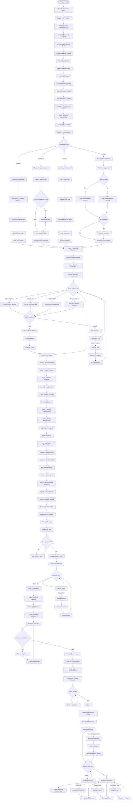

# E-Commerce Platform Database Schema - Feature Flowchart Diagram

```mermaid
flowchart TD
    Start([Start Implementation]) --> Setup[Phase 1: Infrastructure Setup]
    
    Setup --> ProjectInit[Initialize .NET 8 Web API]
    ProjectInit --> EFConfig[Configure Entity Framework Core 8]
    EFConfig --> DISetup[Setup DI Container & Logging]
    DISetup --> DockerSetup[Configure Docker & Health Checks]
    
    DockerSetup --> DBSchema[Phase 1: Database Schema]
    DBSchema --> CoreEntities[Create Core Entities]
    CoreEntities --> EnhancedEntities[Create Enhanced Entities]
    EnhancedEntities --> B2BEntities[Create B2B Entities]
    B2BEntities --> IntlEntities[Create International Entities]
    IntlEntities --> ComplianceEntities[Create Compliance Entities]
    ComplianceEntities --> Migrations[Apply Migrations & Indexes]
    
    Migrations --> APIIntegration[Phase 2: E-Commerce API Integration]
    APIIntegration --> OAuth[Setup OAuth 2.0 Authentication]
    OAuth --> RateLimit[Configure Rate Limiting]
    RateLimit --> CircuitBreaker[Implement Circuit Breaker]
    
    CircuitBreaker --> SyncDecision{Choose Sync Type}
    SyncDecision -->|Products| ProductSync[Product Synchronization]
    SyncDecision -->|Customers| CustomerSync[Customer Synchronization]
    SyncDecision -->|Orders| OrderSync[Order Synchronization]
    SyncDecision -->|Inventory| InventorySync[Inventory Synchronization]
    
    ProductSync --> ProductAPI[Fetch from E-Commerce REST API]
    ProductAPI --> ProductTransform[Transform & Validate Data]
    ProductTransform --> ProductStore[Store in PostgreSQL]
    ProductStore --> ProductCache[Cache Product Data]
    
    CustomerSync --> CustomerAPI[Fetch Customer Data]
    CustomerAPI --> GDPRCheck{GDPR Compliance Check}
    GDPRCheck -->|Pass| CustomerStore[Store Customer Data]
    GDPRCheck -->|Fail| CustomerAnonymize[Anonymize Data]
    CustomerAnonymize --> CustomerStore
    CustomerStore --> CustomerAddresses[Store Customer Addresses]
    
    OrderSync --> OrderAPI[Fetch Order Data]
    OrderAPI --> OrderValidate[Validate Order Data]
    OrderValidate --> OrderStore[Store Orders & Line Items]
    OrderStore --> FulfillmentStore[Store Fulfillments]
    FulfillmentStore --> TransactionStore[Store Transactions]
    
    InventorySync --> InventoryAPI[Fetch Inventory Levels]
    InventoryAPI --> LocationCheck{Multi-Location?}
    LocationCheck -->|Yes| LocationInventory[Store Location-based Inventory]
    LocationCheck -->|No| SingleInventory[Store Single Location Inventory]
    LocationInventory --> LowStockCheck{Low Stock Alert?}
    SingleInventory --> LowStockCheck
    LowStockCheck -->|Yes| SendAlert[Send Low Stock Alert]
    LowStockCheck -->|No| InventoryComplete[Inventory Sync Complete]
    SendAlert --> InventoryComplete
    
    ProductCache --> WebhookPhase[Phase 3: Webhook Integration]
    CustomerAddresses --> WebhookPhase
    TransactionStore --> WebhookPhase
    InventoryComplete --> WebhookPhase
    
    WebhookPhase --> WebhookEndpoints[Create Webhook Endpoints]
    WebhookEndpoints --> SignatureVerify[Implement Signature Verification]
    SignatureVerify --> WebhookRegister[Register Webhook Subscriptions]
    
    WebhookRegister --> WebhookListener{Webhook Received?}
    WebhookListener -->|Product Update| ProductWebhook[Process Product Webhook]
    WebhookListener -->|Order Update| OrderWebhook[Process Order Webhook]
    WebhookListener -->|Inventory Update| InventoryWebhook[Process Inventory Webhook]
    WebhookListener -->|Customer Update| CustomerWebhook[Process Customer Webhook]
    
    ProductWebhook --> VerifySignature{Verify Signature?}
    OrderWebhook --> VerifySignature
    InventoryWebhook --> VerifySignature
    CustomerWebhook --> VerifySignature
    
    VerifySignature -->|Valid| ProcessWebhook[Process Webhook Data]
    VerifySignature -->|Invalid| RejectWebhook[Reject Webhook]
    
    ProcessWebhook --> UpdateDB[Update Database]
    UpdateDB --> InvalidateCache[Invalidate Cache]
    InvalidateCache --> LogEvent[Log Webhook Event]
    
    RejectWebhook --> LogError[Log Security Error]
    LogError --> WebhookListener
    LogEvent --> WebhookListener
    
    LogEvent --> APIPhase[Phase 4: API Development]
    APIPhase --> ProductAPI_Dev[Create Products Controller]
    ProductAPI_Dev --> CustomerAPI_Dev[Create Customers Controller]
    CustomerAPI_Dev --> OrderAPI_Dev[Create Orders Controller]
    OrderAPI_Dev --> InventoryAPI_Dev[Create Inventory Controller]
    InventoryAPI_Dev --> B2BAPI_Dev[Create B2B APIs]
    
    B2BAPI_Dev --> SecurityPhase[Phase 5: Security Implementation]
    SecurityPhase --> JWTAuth[Implement JWT Authentication]
    JWTAuth --> OAuth2[Add OAuth 2.0 Support]
    OAuth2 --> RBAC[Implement RBAC]
    RBAC --> MFA[Add Multi-Factor Authentication]
    
    MFA --> DataEncryption[Implement Data Encryption]
    DataEncryption --> PCICompliance[Implement PCI DSS v4.0.1]
    PCICompliance --> GDPRCompliance[Add GDPR Protection]
    GDPRCompliance --> APISecurity[Implement API Security]
    
    APISecurity --> PerformancePhase[Phase 6: Performance & Monitoring]
    PerformancePhase --> RedisCache[Implement Redis Caching]
    RedisCache --> DBOptimization[Optimize Database Queries]
    DBOptimization --> Monitoring[Setup Application Insights]
    Monitoring --> ErrorHandling[Implement Error Handling]
    
    ErrorHandling --> TestingPhase[Phase 7: Testing]
    TestingPhase --> UnitTests[Create Unit Tests]
    UnitTests --> CoverageCheck{Coverage >= 90%?}
    CoverageCheck -->|No| MoreUnitTests[Add More Unit Tests]
    MoreUnitTests --> CoverageCheck
    CoverageCheck -->|Yes| IntegrationTests[Create Integration Tests]
    
    IntegrationTests --> LoadTests[Perform Load Testing]
    LoadTests --> TestResults{All Tests Pass?}
    TestResults -->|No| FixIssues[Fix Test Issues]
    FixIssues --> TestResults
    TestResults -->|Yes| DeploymentPhase[Phase 8: Deployment]
    
    DeploymentPhase --> Dockerfile[Create Optimized Dockerfile]
    Dockerfile --> CIPipeline[Setup CI/CD Pipeline]
    CIPipeline --> K8sManifests[Create Kubernetes Manifests]
    K8sManifests --> ProductionDeploy[Deploy to Production]
    
    ProductionDeploy --> ProdCheck{Production Health Check?}
    ProdCheck -->|Fail| Rollback[Rollback Deployment]
    Rollback --> FixDeployment[Fix Deployment Issues]
    FixDeployment --> ProductionDeploy
    ProdCheck -->|Pass| DocumentationPhase[Phase 9: Documentation]
    
    DocumentationPhase --> APIDoc[Create API Documentation]
    APIDoc --> SystemDoc[Create System Documentation]
    SystemDoc --> UserTraining[Create User Training Materials]
    
    UserTraining --> ProductionReady{System Ready?}
    ProductionReady -->|No| FinalChecks[Perform Final Checks]
    FinalChecks --> ProductionReady
    ProductionReady -->|Yes| GoLive[Go Live]
    
    GoLive --> MonitoringActive[Continuous Monitoring Active]
    MonitoringActive --> RealTimeSync[Real-time Sync Running]
    RealTimeSync --> MaintenanceMode[Maintenance Mode]
    
    MaintenanceMode --> HealthCheck{System Health OK?}
    HealthCheck -->|Issues| TroubleshootIssues[Troubleshoot Issues]
    TroubleshootIssues --> HealthCheck
    HealthCheck -->|OK| ContinuousOperation[Continuous Operation]
    
    ContinuousOperation --> End([System Operating Successfully])
    
    %% Error Handling Flows
    FixIssues -.->|Critical Error| EmergencyStop[Emergency Stop]
    EmergencyStop --> IncidentResponse[Incident Response]
    IncidentResponse --> SystemRestore[System Restore]
    SystemRestore --> TestResults
    
    %% Maintenance Flows
    MaintenanceMode -.->|Scheduled Maintenance| MaintenanceWindow[Maintenance Window]
    MaintenanceWindow --> SystemUpdate[System Update]
    SystemUpdate --> PostMaintenanceTest[Post-Maintenance Testing]
    PostMaintenanceTest --> HealthCheck
    
    %% Scaling Flows
    ContinuousOperation -.->|High Load| AutoScale[Auto-scale Resources]
    AutoScale --> LoadBalancing[Adjust Load Balancing]
    LoadBalancing --> ContinuousOperation
    
    %% Security Incident Flows
    LogError -.->|Security Incident| SecurityAlert[Security Alert]
    SecurityAlert --> IncidentInvestigation[Incident Investigation]
    IncidentInvestigation --> SecurityMitigation[Security Mitigation]
    SecurityMitigation --> WebhookListener
    
    %% Data Backup Flows
    ContinuousOperation -.->|Daily Backup| BackupProcess[Backup Process]
    BackupProcess --> BackupValidation[Backup Validation]
    BackupValidation --> ContinuousOperation
    
    %% Compliance Audit Flows
    ContinuousOperation -.->|Compliance Audit| AuditProcess[Audit Process]
    AuditProcess --> ComplianceReport[Compliance Report]
    ComplianceReport --> ContinuousOperation
```