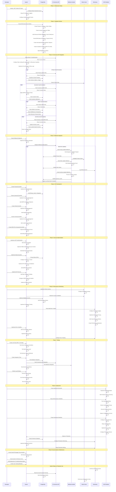

# E-Commerce Platform Database Schema - Feature Sequence Diagram

```mermaid
sequenceDiagram
    participant Dev as Developer
    participant Sys as System
    participant DB as PostgreSQL
    participant API as E-Commerce API
    participant WH as Webhook Handler
    participant Cache as Redis Cache
    participant Mon as Monitoring
    participant CI as CI/CD Pipeline

    Note over Dev,CI: Phase 1: Infrastructure Setup
    Dev->>Sys: Initialize .NET 8 Web API Project
    Sys->>DB: Configure Entity Framework Core 8
    Sys->>Sys: Setup DI Container & Logging
    Sys->>Sys: Configure Docker & Health Checks
    
    Note over Dev,CI: Phase 1: Database Schema
    Dev->>DB: Create DbContext & Core Entities
    DB->>DB: Create Products, Customers, Orders Tables
    DB->>DB: Create Inventory, Collections Tables
    DB->>DB: Add Enhanced Entities (Metafields, Smart Collections)
    DB->>DB: Create B2B Entities (Companies, Payment Terms)
    DB->>DB: Create International Entities (Markets, Regions)
    DB->>DB: Create Compliance Entities (GDPR, PCI DSS)
    DB->>DB: Apply Migrations & Indexes
    
    Note over Dev,CI: Phase 2: E-Commerce API Integration
    Dev->>API: Setup OAuth 2.0 Authentication
    API-->>Sys: Return Access Token
    Sys->>Sys: Configure Rate Limiting (40 req/sec REST, 1000 pts/sec GraphQL)
    Sys->>Sys: Implement Circuit Breaker & Retry Logic
    
    loop Product Synchronization
        Sys->>API: Fetch Products (REST API)
        API-->>Sys: Return Product Data
        Sys->>DB: Transform & Store Products
        Sys->>DB: Store Variants, Options, Images
        Sys->>Cache: Cache Product Data
    end
    
    loop Customer Synchronization
        Sys->>API: Fetch Customers (REST API)
        API-->>Sys: Return Customer Data
        Sys->>Sys: Apply GDPR Compliance Rules
        Sys->>DB: Store Customer Data
        Sys->>DB: Store Customer Addresses
    end
    
    loop Order Synchronization
        Sys->>API: Fetch Orders (REST API)
        API-->>Sys: Return Order Data
        Sys->>DB: Store Orders & Line Items
        Sys->>DB: Store Fulfillments & Transactions
        Sys->>DB: Store Refunds & Financial Data
    end
    
    loop Inventory Synchronization
        Sys->>API: Fetch Inventory Levels (REST API)
        API-->>Sys: Return Inventory Data
        Sys->>DB: Update Inventory Levels
        Sys->>DB: Track Location-based Inventory
        Sys->>Sys: Check Low Stock Alerts
    end
    
    Note over Dev,CI: Phase 3: Webhook Integration
    Dev->>Sys: Create Webhook Endpoints
    Sys->>Sys: Implement Signature Verification
    Sys->>API: Register Webhook Subscriptions
    
    loop Real-time Updates
        API->>WH: Send Product Update Webhook
        WH->>WH: Verify Signature & Validate Payload
        WH->>DB: Update Product Data
        WH->>Cache: Invalidate Product Cache
        
        API->>WH: Send Order Update Webhook
        WH->>WH: Verify Signature & Route Event
        WH->>DB: Update Order Status
        WH->>Mon: Log Webhook Event
        
        API->>WH: Send Inventory Update Webhook
        WH->>WH: Process Inventory Change
        WH->>DB: Update Inventory Levels
        WH->>Sys: Trigger Low Stock Alert (if needed)
    end
    
    Note over Dev,CI: Phase 4: API Development
    Dev->>Sys: Create ProductsController
    Sys->>Sys: Implement CRUD Operations
    Sys->>DB: Add Filtering, Search, Pagination
    
    Dev->>Sys: Create CustomersController
    Sys->>Sys: Implement Customer Management
    Sys->>Sys: Add GDPR Compliance Endpoints
    
    Dev->>Sys: Create OrdersController
    Sys->>Sys: Implement Order Management
    Sys->>Sys: Add Analytics & Reporting
    
    Dev->>Sys: Create InventoryController
    Sys->>Sys: Implement Inventory Management
    Sys->>Sys: Add Location-based Queries
    
    Dev->>Sys: Create B2B APIs (CompaniesController)
    Sys->>Sys: Implement B2B Payment Terms
    Sys->>Sys: Add Selling Plans Management
    
    Note over Dev,CI: Phase 5: Security Implementation
    Dev->>Sys: Implement JWT Authentication
    Sys->>Sys: Add OAuth 2.0 Support
    Sys->>Sys: Implement RBAC (Role-Based Access Control)
    Sys->>Sys: Add Multi-Factor Authentication
    
    Dev->>Sys: Implement Data Encryption
    Sys->>DB: Encrypt Data at Rest
    Sys->>Sys: Configure TLS/SSL for Transit
    Sys->>Sys: Implement PCI DSS v4.0.1 Compliance
    Sys->>Sys: Add GDPR Data Protection
    
    Dev->>Sys: Implement API Security
    Sys->>Sys: Add Rate Limiting & Throttling
    Sys->>Sys: Configure CORS & Security Headers
    Sys->>Sys: Implement DDoS Protection
    
    Note over Dev,CI: Phase 6: Performance & Monitoring
    Dev->>Cache: Implement Redis Caching
    Cache->>Cache: Configure Distributed Caching
    Sys->>Cache: Implement Cache Invalidation
    
    Dev->>DB: Optimize Database Queries
    DB->>DB: Add Performance Indexes
    Sys->>Sys: Implement Connection Pooling
    
    Dev->>Mon: Setup Application Insights
    Mon->>Mon: Configure Structured Logging
    Mon->>Mon: Implement Distributed Tracing
    Mon->>Mon: Add Custom Business Metrics
    Mon->>Mon: Create Performance Dashboards
    
    Dev->>Sys: Implement Error Handling
    Sys->>Sys: Add Circuit Breaker Patterns
    Sys->>Sys: Implement Retry Policies
    Sys->>Mon: Configure Error Tracking
    
    Note over Dev,CI: Phase 7: Testing
    Dev->>Sys: Create Unit Tests (90%+ Coverage)
    Sys->>Sys: Test Service Classes & Controllers
    Sys->>Sys: Test Data Access Layer
    Sys->>Sys: Test Business Logic & Webhooks
    
    Dev->>Sys: Create Integration Tests
    Sys->>DB: Test Database Integration
    Sys->>API: Test E-Commerce API Integration
    Sys->>WH: Test Webhook Integration
    Sys->>Sys: Test End-to-End Workflows
    
    Dev->>Sys: Perform Load Testing
    Sys->>Sys: Execute Stress Testing
    Sys->>Sys: Run Performance Benchmarks
    Sys->>Sys: Test Concurrent Users
    
    Note over Dev,CI: Phase 8: Deployment
    Dev->>CI: Create Optimized Dockerfile
    CI->>CI: Implement Multi-stage Builds
    CI->>CI: Add Container Security Scanning
    
    Dev->>CI: Setup GitHub Actions Workflow
    CI->>CI: Run Automated Testing
    CI->>CI: Perform Code Quality Checks
    CI->>CI: Execute Security Scanning
    CI->>CI: Deploy to Staging Environment
    
    Dev->>CI: Create Kubernetes Manifests
    CI->>CI: Configure Service Discovery
    CI->>CI: Setup Load Balancing
    CI->>CI: Implement Auto-scaling
    CI->>CI: Configure Persistent Volumes
    
    CI->>Sys: Deploy to Production
    Sys->>DB: Setup Production Database
    Sys->>Mon: Configure Production Monitoring
    Sys->>Sys: Implement Backup Procedures
    Sys->>Mon: Setup Production Alerting
    
    Note over Dev,CI: Phase 9: Documentation & Maintenance
    Dev->>Sys: Create OpenAPI/Swagger Documentation
    Sys->>Sys: Add Interactive API Explorer
    Dev->>Sys: Create System Architecture Docs
    Dev->>Sys: Add Deployment & Troubleshooting Guides
    Dev->>Sys: Create User Training Materials
    
    Note over Dev,CI: System Ready for Production Use
    Mon->>Mon: Continuous Monitoring Active
    Sys->>API: Real-time Synchronization Running
    DB->>DB: Data Replication Complete
    Cache->>Cache: Performance Optimization Active
```